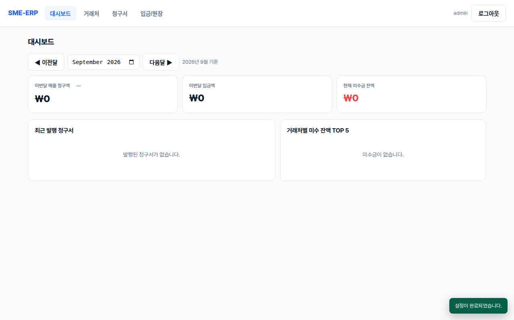
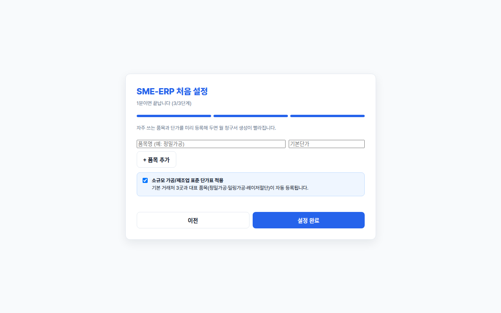

# SME-ERP — 소규모 제조업을 위한 1분 온보딩 오픈소스 ERP

> **"엑셀 정리로 야근하던 공장장님과 경리 실장님, 이제 클릭 몇 번으로 끝내세요."**  
> 복잡한 설정 없이 **1분 만에 설치**하고, **월말 청구서 발행(5초)**부터 **입금·미수금 원장 정리**까지 한 번에 해결합니다.

---

## 📥 지금 바로 다운로드 (Windows 전용)

아래 버튼을 누르면 릴리스 페이지에서 최신 파일을 내려받으실 수 있습니다.

| 배포 형태 | 다운로드 링크 | 권장 대상 |
|:---|:---:|:---|
| **설치형 (권장)** | [-0284c7?style=for-the-badge&logo=windows)](https://github.com/harry81/clevr/releases/latest) | 바탕화면에 바로가기를 만들고 계속 쓰실 분 |
| **무설치형 (포터블)** | [-64748b?style=for-the-badge&logo=windows)](https://github.com/harry81/clevr/releases/latest) | 설치 없이 바로 실행하거나 USB에 담아 쓰실 분 |

*지원 운영체제: Windows 10, Windows 11 (64-bit)*

---

## ✨ 왜 엑셀 대신 SME-ERP인가요? (3대 핵심 경험)



1. ⚡ **[온보딩 1분] 빈 화면 제로, 표준 단가표 자동 준비**
   - 프로그램을 깔자마자 회사명만 입력하면, 우리 공장에서 자주 쓰는 대표 가공 품목과 단가표가 자동으로 채워집니다. 빈 화면에서 고민할 필요가 없습니다.
2. ⏱️ **[월말 5초] 4시간 걸리던 월말 청구서가 클릭 한 번에**
   - 거래처별 단가표를 바탕으로 공급가액과 부가세를 자동 계산하여 청구서 번호를 매기고, 장부에 한 번에 기록합니다.
3. 💰 **[입금 즉시] 쪼개서 들어온 입금도 알아서 척척 (미수금 완벽 추적)**
   - 거래처에서 돈을 나눠서 보내도, 가장 오래된 청구서부터 순서대로 차감(선입선출)하여 실시간 미수잔액을 오차 없이 관리합니다.

---

## 🚀 3단계 초간단 설치 & 시작 가이드

### 1단계: 다운로드 & 실행
- 위의 **[Windows 설치파일 다운로드]** 버튼을 눌러 `SME-ERP-Setup-x.x.x.exe` 파일을 내려받고 실행합니다.
- 설치 없이 바로 쓰실 분은 **`SME-ERP-Portable-x.x.x.exe`**(무설치 실행파일)를 내려받아 더블클릭하면 됩니다.

---

### 2단계: 윈도우 파란색 경고창(SmartScreen) 해결법
> ⚠️ **처음 실행할 때 "Windows의 PC 보호" 창이 떠도 안심하세요!**  
> 코드 서명이 없는 무료 프로그램이라 발생하는 정상적인 알림입니다. 컴퓨터에 아무런 이상이 없습니다.

```
┌────────────────────────────────────────────────────────────┐
│ Windows의 PC 보호                                           │
│ Microsoft Defender SmartScreen에서 인식할 수 없는 앱의 시작을  │
│ 차단했습니다.                                              │
│                                                            │
│ 1. [추가 정보] 글자를 클릭합니다. (밑줄 링크)               │
│ 2. 우측 하단에 새로 생기는 [실행] 버튼을 누르면 설치됩니다!  │
└────────────────────────────────────────────────────────────┘
```
1. 창 왼쪽 상단의 **`[추가 정보]`** 파란색 글씨를 누릅니다.
2. 오른쪽 아래에 나타나는 **`[실행]`** 버튼을 누르면 정상적으로 설치가 진행됩니다.

---

### 3단계: 60초 마법사로 내 공장 장부 완성

1. **회사 정보 입력**: 상호와 사업자등록번호를 적습니다.
2. **관리자 비밀번호 설정**: 프로그램 접속 시 사용할 비밀번호를 정합니다.
3. **표준 단가표 체크**: '소규모 제조업 표준 단가표 적용'에 체크하고 **[설정 완료]**를 누르면 끝!

---

## 🔒 100% 안전한 내 컴퓨터 보안 (Local-First 원칙)

* **외부 유출 제로**: 모든 거래처 장부와 단가 데이터는 **오직 사장님의 PC 안(`내 컴퓨터`)에만 저장**됩니다. 인터넷 연결이 끊겨도 작동하며, 외부 클라우드 서버로 데이터를 절대 보내지 않습니다.
* **비밀번호 암호화**: 로그인 비밀번호는 최고 수준의 암호화 알고리즘(`scrypt`)으로 안전하게 잠겨 있어 본인 외에는 열람할 수 없습니다.
* **안전한 데이터 보존**: 프로그램을 실수로 지우거나 재설치해도 기존 장부 데이터(`mycompany.db`)는 절대 삭제되지 않고 유지됩니다.

---

<details>
<summary><strong>🛠️ 개발자 가이드 및 소스 빌드 (클릭하여 펼치기)</strong></summary>

### 개발 환경 실행

```bash
# 1. 저장소 복제
git clone https://github.com/harry81/clevr.git sme-erp
cd sme-erp

# 2. 의존성 설치
npm install

# 3. 개발 모드 앱 기동
npm start
```

* 요구 사양: Node.js v22.13 이상 (내장 `node:sqlite` 활용), Windows 10+ x64.

### 기술 스택
- **Runtime**: Electron v44.3.0
- **Frontend**: Vanilla JS SPA (No-bundler, `window.App` architecture)
- **Database**: Node.js 22 내장 SQLite (WAL mode, 단일 프로세스 내 동기 접근)
- **Security**: Node 내장 `crypto.scrypt` + Salt
- **Packaging**: `electron-builder` (NSIS Installer + Portable)

### 테스트 수행

```bash
npm test            # 단위 테스트 전수 검증
npm run test:e2e    # E2E 전체 비즈니스 흐름(온보딩→청구→입금→대시보드) 검증
npm run test:runtime # Electron 런타임 스모크 테스트
```

### 라이선스 (License)
본 프로젝트는 [MIT License](LICENSE)에 따라 자유롭게 사용, 수정, 배포할 수 있습니다.  
Copyright (c) 2026 SME-ERP Contributors.

</details>
