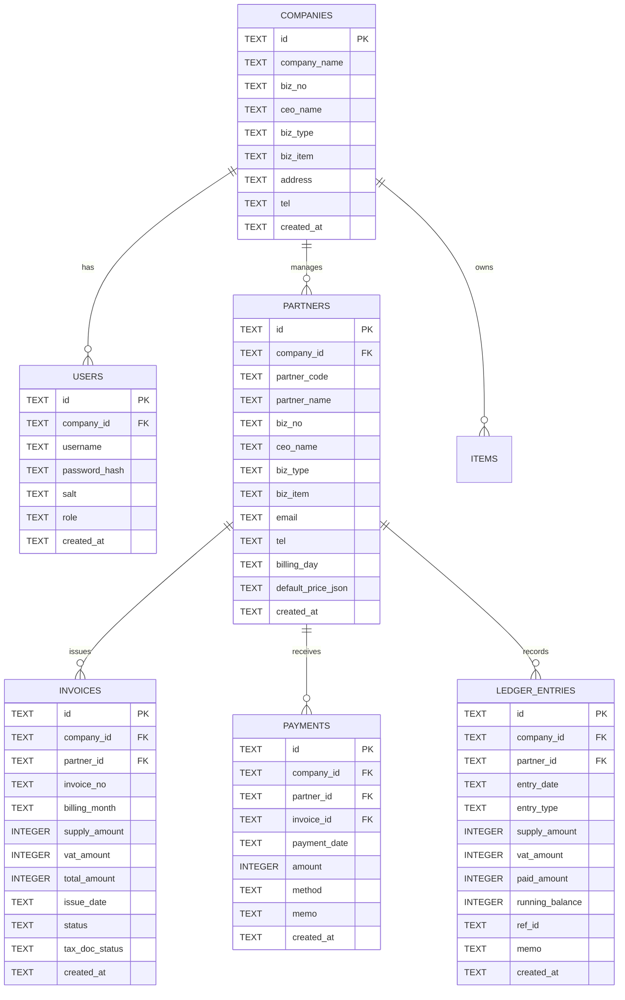

# 10인 이하 제조업체용 오픈소스 ERP (SME-ERP) 상세 Task Breakdown (WBS)

> **문서 버전**: v1.0 (Stitch Approved UI Spec 기반 전환 계획)  
> **기준 문서**: `stitch_prompts_and_design_spec.md` (승인됨)  
> **작업 대상**: 10인 이하 소규모 제조업 특화 경량 오픈소스 ERP (`SME-ERP`)  
> **수행 원칙**: TDD (Red → Green → Refactor), 코드 검증, P0 보안/데이터 게이트 선제 완료  

---

## 1. 개요 및 전환 전략

### 1.1 배경 및 목표
- 기존 특정 안전관리 대행업(`GENSYS`, 하드코딩 계정/시드, 구 시스템 종속) 코드를 탈피하고, 승인된 Stitch 디자인 스펙에 맞추어 **10인 이하 소규모 제조업체(한빛정밀 등 가공·제조업)**가 즉시 자가 설치 후 사용할 수 있는 독립형 오픈소스 ERP(`SME-ERP`)로 전환합니다.
- 복잡하고 무거운 대기업용 ERP 기능을 배제하고, 현장에서 매월 반복되는 핵심 5대 화면의 완성도와 데이터 정합성, 단독 실행 안정성에 집중합니다.

### 1.2 5대 핵심 화면 범위
1. **화면 ⑤ 온보딩 마법사 (`Onboarding Wizard`)**: 첫 실행 시 사업장 정보(상호, 사업자번호, 대표자, 업태/종목, 주소 등) 입력 + 관리자 계정 생성(암호화 해시) + 초기 품목 등록.
2. **화면 ① 메인 대시보드 (`Dashboard`)**: 월 매출 청구액, 입금액, 미수금 잔액 KPI 3종 카드 + 최근 발행 청구서 + 거래처별 미수잔액 TOP 5.
3. **화면 ② 거래처 관리 (`Partner Directory & Slide-over Drawer`)**: 제조업체 특화 거래처 목록 + 슬라이드오버 상세/수정 드로어(기본정보, 담당자, 과금조건, 품목단가표).
4. **화면 ③ 매출 청구서 월 일괄등록 & 관리 (`Invoice Batch & Billing`)**: 정기 월 청구 일괄 생성 배너/기능 + 청구서 목록(완납/부분/미납) + 세금계산서 상태 플래그.
5. **화면 ④ 입금 등록 & 거래처 원장 (`Receipts & Running Ledger`)**: 2열 분할(좌측: 거래처 미수잔액 목록 / 우측: 실시간 거래처 원장 타임라인 + 즉시 입금등록 카드 및 차인지급잔액 계산).

### 1.3 P0 필수 게이트 (P0 Pre-requisite Gates)
1. **GENSYS 시드 및 하드코딩 계정 완전 제거**:
   - `db/localStore.js` 내 기본 관리자 `GENSYS/HQ/admin/1234` 및 `B1~B3` 하드코딩 제거.
   - DB 미설정 상태일 경우 자동으로 온보딩 화면으로 라우팅.
2. **비밀번호 단방향 암호화 해시 (Password Security)**:
   - 평문(`1234`) 저장 전면 폐지.
   - Node.js 표준 내장 모듈 `crypto.scryptSync` 또는 `crypto.pbkdf2Sync` + Salt 적용 (추가 의존성 불필요).
3. **SQLite(WAL 모드) 실이행 스키마 구축**:
   - 파일 분실·동시성 충돌 방지: `%LOCALAPPDATA%\SME-ERP\data\mycompany.db`.
   - `PRAGMA journal_mode = WAL;`, `PRAGMA synchronous = NORMAL;`, `PRAGMA foreign_keys = ON;`.
   - SQLite 테이블 스키마 및 마이그레이션 모듈 구현 (`companies`, `users`, `partners`, `items`, `invoices`, `payments`, `ledger`).

---

## 2. 모듈 아키텍처 및 데이터 흐름

### 2.1 데이터베이스 ERD 구조 (SQLite)



### 2.2 비즈니스 계산 규칙 (한국 세무·제조 기준)
- **부가가치세 (VAT)**: `vat = Math.trunc(supply_amount * 0.1)` (원 단위 절사).
- **합계금액 (Total)**: `total_amount = supply_amount + vat_amount`.
- **원장 잔액 (Running Balance)**: `신규 잔액 = 이전 잔액 + 청구합계금액 - 입금액`.

---

## 3. 세부 WBS & 태스크 분해 (Worker TDD 실행 단위)

각 태스크는 `myapp-worker`가 테스트를 먼저 작성(Red)하고 구현(Green)한 뒤 리팩토링(Refactor)할 수 있도록 구체적인 입력/출력 및 완료 기준을 명시합니다.

```
[Phase 0: P0 기반 및 스키마]
   ├─ T1: 암호화 인증 엔진 (Password Hasher & Verifier)
   ├─ T2: SQLite 스키마 생성 및 WAL 초기화 엔진
   └─ T3: 온보딩 서비스 & GENSYS 잔재 제거

[Phase 1: 백엔드 도메인 서비스 TDD]
   ├─ T4: 거래처(Partner) 및 품목단가 관리 모듈
   ├─ T5: 월 청구서 일괄발행 및 VAT 계산 엔진
   ├─ T6: 입금 처리 및 거래처 원장(Ledger) 실시간 계산기
   └─ T7: 대시보드 KPI 집계 쿼리 엔진

[Phase 2: IPC & 메인 프로세스 연동]
   └─ T8: Electron IPC 채널 정비 및 SME-ERP 브릿지 노출

[Phase 3: 프론트엔드 5대 화면 재구축]
   ├─ T9: 화면 ⑤ 온보딩 마법사 UI
   ├─ T10: 화면 ① 메인 대시보드 UI
   ├─ T11: 화면 ② 거래처 관리 & 슬라이드 드로어 UI
   ├─ T12: 화면 ③ 매출 청구서 월 일괄등록 & 관리 UI
   └─ T13: 화면 ④ 입금 등록 & 거래처 실시간 원장 UI

[Phase 4: 통합 검증 및 패키징]
   └─ T14: 전체 E2E 시나리오 테스트 및 클린업
```

---

### [Phase 0] P0 기반 인프라 및 보안 게이트

#### T1. 비밀번호 단방향 암호화 모듈 구현 (TDD)
- **목표**: 평문 비밀번호를 안전한 salt + 단방향 해시로 변환 및 검증하는 독립 모듈 개발.
- **테스트 파일**: `tests/unit/security/hasher.test.js`
- **구현 파일**: `src/shared/security/hasher.js`
- **입력**: 평문 비밀번호 문자열 (`"admin1234!"`).
- **출력**: `{ hash: string, salt: string }`, 검증 함수 `verifyPassword(password, hash, salt): boolean`.
- **완료 기준**:
  1. `crypto.scryptSync` (또는 PBKDF2)를 활용하여 16바이트 랜덤 salt 생성.
  2. 일치하는 비밀번호 검증 시 `true`, 불일치 시 `false` 반환.
  3. 빈 문자열 또는 유효하지 않은 인자 전달 시 예외 처리.
  4. 외부 무거운 라이브러리 없이 Node.js 내장 `crypto` 모듈만 사용.

#### T2. SQLite WAL 초기화 엔진 및 스키마 DDL 마이그레이터 (TDD)
- **목표**: %LOCALAPPDATA%/SME-ERP 경로 보장, WAL 모드 활성화, 7개 핵심 테이블 스키마 DDL 생성. *(TM 정정: 완료기준 ③·ERD 기준 7개 — 2026-09-09)*
- **테스트 파일**: `tests/unit/db/sqliteEngine.test.js`
- **구현 파일**: `src/main/db/schema.sql`, `src/main/db/sqliteEngine.js`
- **입력**: DB 파일 경로 (메모리 `:memory:` 또는 실제 파일 경로).
- **출력**: 초기화된 SQLite DB 커넥션 인스턴스.
- **완료 기준**:
  1. `node:sqlite` (Node v22 내장) 또는 경량 SQLite 드라이버로 연결.
  2. `PRAGMA journal_mode = WAL;` 설정 성공 검증.
  3. `companies`, `users`, `partners`, `items`, `invoices`, `payments`, `ledger_entries` 테이블 생성 완료.
  4. 인덱스 생성 (`idx_invoices_partner_date`, `idx_ledger_partner_date`).
  5. `walCheckpointTruncate()` 훅을 제공하여 백업 시 WAL flush 지원.

#### T3. 온보딩 상태 확인 및 초기화 서비스 (GENSYS 완전 격리) (TDD)
- **목표**: DB 최초 부팅 시 사업장 등록 여부(`companies` count)를 확인하고, 온보딩 완료 전까지 GENSYS 기본 사용자 로딩을 전면 차단.
- **테스트 파일**: `tests/unit/services/onboardingService.test.js`
- **구현 파일**: `src/main/services/onboardingService.js`
- **입력**: 온보딩 폼 데이터 (회사정보, 관리자 ID/PW, 초기 품목).
- **출력**: 생성된 회사 ID, 관리자 계정 ID, 온보딩 완료 플래그.
- **완료 기준**:
  1. 초기 DB 상태에서 `isOnboardingNeeded()` 호출 시 `true` 반환.
  2. 기존의 `GENSYS/HQ/admin/1234` 기본 계정이 생성되지 않음을 보장.
  3. `completeOnboarding(data)` 호출 시 단일 트랜잭션(`BEGIN IMMEDIATE`)으로 회사 등록 + 관리자 비밀번호 해시 저장 + 품목 등록 수행.
  4. 사업자등록번호 유효성 정규식 검증 (`/^\d{3}-\d{2}-\d{5}$/`).

---

### [Phase 1] 백엔드 도메인 서비스 TDD

#### T4. 거래처(Partner) 및 품목단가 관리 모듈 (TDD)
- **목표**: 10인 이하 제조업체 맞춤형 거래처 등록/조회/수정 및 품목별 단가표 JSON 관리.
- **테스트 파일**: `tests/unit/services/partnerService.test.js`
- **구현 파일**: `src/main/services/partnerService.js`
- **입력**: 거래처 CRUD 페이로드 (상호, 사업자번호, 대표, 업태, 종목, 담당자 이메일/전화, 단가표 배열).
- **출력**: 거래처 엔티티 객체 및 검색 결과 목록.
- **완료 기준**:
  1. 거래처 등록 시 중복 사업자번호 검사 (동일 회사 내 중복 불가).
  2. 품목 단가표(`[{ itemName: '정밀가공A', unitPrice: 12500 }]`)의 유효성 검증 및 저장.
  3. 거래처명/사업자번호 기반 부분 검색(LIKE) 및 정렬 지원.
  4. 거래처별 현재 미수금 잔액 필드가 함께 계산되어 반환.

#### T5. 월 청구서 일괄발행 및 한국형 VAT 계산 엔진 (TDD)
- **목표**: 제조업체들이 매월 말일 수행하는 "월 일괄 청구서 생성" 및 세무 부가세 계산 로직 구현.
- **테스트 파일**: `tests/unit/services/invoiceService.test.js`
- **구현 파일**: `src/main/services/invoiceService.js`
- **입력**: 청구년월 (`"2026-09"`), 발행 대상 거래처 목록 및 공급가액.
- **출력**: 생성된 청구서 목록, 배치 발행 요약 결과 (총 건수, 공급가액 합계, VAT 합계).
- **완료 기준**:
  1. VAT 계산식 `Math.trunc(supply_amount * 0.1)` 원 단위 절사 엄격 검증.
  2. 청구번호 자동 채번 규칙: `INV-YYYYMM-0001` 순번 부여.
  3. 청구서 생성 시 원장(`ledger_entries`)에 `매출청구` 항목으로 동시 자동 기표 (트랜잭션 일관성).
  4. 동일 거래처에 대해 동일 청구년월 중복 발행 방지(또는 덮어쓰기 옵션) 처리.

#### T6. 입금 처리 및 거래처 실시간 원장(Running Ledger) 계산기 (TDD)
- **목표**: 입금액 입력 시 차인지급잔액(Running Balance) 실시간 재계산 및 부분/완납 상태 자동 갱신.
- **테스트 파일**: `tests/unit/services/ledgerService.test.js`
- **구현 파일**: `src/main/services/ledgerService.js`
- **입력**: 입금 등록 페이로드 (거래처 ID, 입금일자, 금액, 결제방법, 메모).
- **출력**: 기표된 입금 기록 및 갱신된 거래처 잔액, 관련 청구서의 상태(`완납`/`부분입금`/`미납`).
- **완료 기준**:
  1. 입금 등록 시 `payments` 테이블에 저장 및 `ledger_entries`에 `입금` 항목 기록.
  2. 해당 거래처의 미수 청구서 중 오래된 순(FIFO)으로 입금액 자동 충당(Allocation).
  3. 청구금액 전액 충당 시 청구서 상태 `완납(PAID)`, 일부 충당 시 `부분입금(PARTIAL)`, 미충당 시 `미납(UNPAID)` 자동 전환.
  4. 거래처별 전체 거래 타임라인 조회 시 각 행마다 누적 `running_balance`가 정확히 계산됨.

#### T7. 대시보드 핵심 KPI 및 미수금 TOP5 쿼리 엔진 (TDD)
- **목표**: 메인 대시보드 상단 3개 메트릭 카드 및 하단 테이블 2종에 필요한 집계 데이터를 단일 쿼리로 최적화.
- **테스트 파일**: `tests/unit/services/dashboardService.test.js`
- **구현 파일**: `src/main/services/dashboardService.js`
- **입력**: 회사 ID, 기준 년월 (`"2026-09"`).
- **출력**:
  - `kpi`: `{ billedAmount, paidAmount, outstandingAmount, growthRate }`
  - `recentInvoices`: 최근 청구서 5건
  - `topDebtors`: 미수 잔액 상위 5개 거래처 목록
- **완료 기준**:
  1. 이번 달 총 청구액, 입금액, 전체 누적 미수금 합계의 정확한 산출.
  2. 전월 대비 청구액 증감률 계산식 검증 (전월이 0원인 경우 엣지 케이스 포함).
  3. 미수잔액 TOP 5 거래처가 미수금 내림차순으로 정확히 정렬되어 반환.

---

### [Phase 2] IPC & 프리로드 브릿지 연동

#### T8. IPC 핸들러 표준화 및 Preload API 노출
- **목표**: 메인 프로세스와 렌더러 간의 IPC 채널을 5대 핵심 도메인 기준으로 정리 및 타입-안전 래핑.
- **구현 파일**: `main.js`, `preload.js`
- **채널 정의**:
  - `auth:*` (`login`, `logout`, `checkSession`)
  - `onboarding:*` (`getStatus`, `submit`)
  - `dashboard:*` (`getSummary`)
  - `partners:*` (`list`, `get`, `save`, `delete`)
  - `invoices:*` (`list`, `createBatch`, `updateStatus`)
  - `ledger:*` (`getPartnerLedger`, `recordPayment`)
- **완료 기준**:
  1. 구 레거시 대행업 IPC 채널(`educations`, `trainees`, `hrEmployees` 등)을 SME-ERP 코어와 분리/정리.
  2. 인자 검증(Validation) 및 에러 발생 시 일관된 `{ ok: false, message: string }` 형식 응답.
  3. Electron preload의 `contextBridge`에 `window.api.sme.*` 네임스페이스로 바인딩.

---

### [Phase 3] 프론트엔드 5대 핵심 화면 재구축 (Stitch UI 스펙 반영)

#### T9. 화면 ⑤ : 첫 실행 온보딩 마법사 UI 구축
- **스펙 참조**: `stitch_prompts_and_design_spec.md` 화면 ⑤
- **구현 파일**: `renderer/pages/onboarding.html` (또는 SPA 모달 뷰), `renderer/js/views/onboardingView.js`, `renderer/styles/onboarding.css`
- **주요 구성 요소**:
  - 중앙 카드 레이아웃 + 상단 3단계 프로그레스 바.
  - Step 1: 회사명, 대표자명, 사업자번호(마스크 자동 하이픈), 업태/종목, 주소, 대표전화.
  - Step 2: 관리자 아이디, 관리자 비밀번호, 비밀번호 확인.
  - Step 3: 초기 주요 품목 1~2개 입력 (품목명, 기본단가).
- **완료 기준**:
  1. 첫 실행 시 자동 온보딩 모달 노출.
  2. 유효성 검사 실패 시(비밀번호 불일치, 필수값 누락) 인라인 오류 메시지 표시.
  3. 온보딩 완료 버튼 클릭 시 백엔드 DB 저장 후 즉시 로그인/대시보드로 매끄럽게 전환.

#### T10. 화면 ① : 메인 대시보드 (KPI & 미수금 현황) UI
- **스펙 참조**: `stitch_prompts_and_design_spec.md` 화면 ①
- **구현 파일**: `renderer/js/views/dashboardView.js`, `renderer/styles/dashboard.css`
- **주요 구성 요소**:
  - 상단 3대 KPI 카드: 이번달 매출 청구액(증감률 배지), 이번달 입금액, 현재 미수금 잔액(주의 붉은 강조).
  - 좌측 하단: "최근 발행 청구서" 테이블 (청구일, 거래처명, 청구금액, 완납/미납 배지).
  - 우측 하단: "거래처별 미수 잔액 TOP 5" 카드 + "원장 바로가기" 링크.
- **완료 기준**:
  1. 앱 기동 시 대시보드가 기본 화면으로 렌더링.
  2. 숫자 서식(`Intl.NumberFormat('ko-KR')`) ₩ 통화 기호 및 천 단위 콤마 일괄 적용.
  3. TOP 5 원장 링크 클릭 시 해당 거래처의 "화면 ④ 입금/원장"으로 즉시 탭 전환.

#### T11. 화면 ② : 거래처 관리 & 슬라이드오버 드로어 UI
- **스펙 참조**: `stitch_prompts_and_design_spec.md` 화면 ②
- **구현 파일**: `renderer/js/views/partnerView.js`, `renderer/styles/partner.css`
- **주요 구성 요소**:
  - 상단 툴바: 거래처 검색 인풋, 거래처 필터, "+ 신규 거래처 등록" 버튼.
  - 거래처 그리드 테이블: 코드, 거래처명, 사업자번호, 대표자, 주요품목, 기본공급단가, 미수잔액, 관리액션.
  - 우측 슬라이드오버 드로어: 거래처 기본정보, 세금계산서 담당자 이메일, 거래조건, 단가표 편집 폼.
- **완료 기준**:
  1. 슬라이드오버 드로어가 부드럽게 열리고 닫힘 (`transform: translateX`).
  2. 신규 등록 및 기존 거래처 수정 시 드로어에서 실시간 유효성 체크 및 저장.
  3. 저장 완료 시 테이블 목록이 즉시 리프레시되고 Toast 피드백 표시.

#### T12. 화면 ③ : 매출 청구서 월 일괄등록 & 관리 UI
- **스펙 참조**: `stitch_prompts_and_design_spec.md` 화면 ③
- **구현 파일**: `renderer/js/views/invoiceView.js`, `renderer/styles/invoice.css`
- **주요 구성 요소**:
  - 상단 툴바: 년월 셀렉터(`2026년 9월`), 상태 탭(`전체`, `미발행`, `발행완료`, `미납`), "월 일괄 청구서 생성" 버튼.
  - 일괄 청구 요약 배너: 대상 건수, 총 공급가액, 총 VAT 표시.
  - 청구서 리스트: 체크박스, 청구번호, 거래처, 공급가액, VAT, 합계, 상태 뱃지, 세금계산서 상태.
  - 하단/상단 액션: 선택 인쇄, 엑셀 다운로드.
- **완료 기준**:
  1. "월 일괄 청구서 생성" 클릭 시 등록된 모든 활성 거래처의 기본 단가 기준 청구서 자동 산출 모달 오픈 및 일괄 기표.
  2. 상태 탭 전환 시 즉시 클라이언트 필터링.
  3. 체크박스 다중 선택 및 공급가액/VAT 합계 실시간 반영.

#### T13. 화면 ④ : 입금 등록 & 거래처 실시간 원장 UI
- **스펙 참조**: `stitch_prompts_and_design_spec.md` 화면 ④
- **구현 파일**: `renderer/js/views/ledgerView.js`, `renderer/styles/ledger.css`
- **주요 구성 요소**:
  - 좌측 패널 (35%): 거래처 검색 인풋 + 거래처별 총 청구, 총 입금, 현재 미수잔액 카드 리스트.
  - 우측 패널 (65%):
    - 상단: 선택된 거래처 요약 헤더 (미수잔액 대형 강조 표시).
    - 중단: 빠른 "입금 등록" 폼 카드 (입금일자, 입금액, 결제수단[계좌이체/어음/카드], 메모, "입금 반영" 버튼).
    - 하단: 원장 거래 내역 테이블 (일자, 구분, 공급가액, 부가세, 입금액, 차인지급잔액).
- **완료 기준**:
  1. 좌측에서 거래처 선택 시 우측 원장 타임라인이 비동기로 즉시 로드.
  2. "입금 반영" 실행 시 원장 하단에 실시간 행이 추가되고 누적 차인지급잔액과 상단 미수잔액이 즉시 재계산되어 갱신.
  3. 입금액이 0원 이하이거나 미수금보다 과도할 경우 확인 다이얼로그 처리.

---

### [Phase 4] 통합 검증 및 릴리스 준비

#### T14. 전체 플로우 E2E 통합 테스트 및 패키지 검증
- **목표**: 설치 후 온보딩 → 거래처 등록 → 청구서 일괄발행 → 입금 처리 → 대시보드 KPI 반영 전 과정 시나리오 검증.
- **테스트 파일**: `tests/integration/smeErpFlow.test.js`
- **검증 시나리오**:
  1. 클린 DB 상태에서 온보딩 실행 (한빛정밀 사업장 + admin 계정 생성).
  2. 관리자 로그인 성공 (암호화 해시 인증).
  3. 거래처 2개 등록 (정밀가공 품목단가 지정).
  4. 당월 청구서 일괄 발행 (VAT 원단위 절사 검증).
  5. 거래처 1곳에 대해 부분 입금 및 다른 1곳에 대해 완납 처리.
  6. 대시보드 KPI 카드 및 미수금 TOP 5 위젯 수치 정합성 검증.
  7. Electron 빌드 및 실행 무결성 체크.

---

## 4. 태스크 매트릭스 및 의존성 관계

| 태스크 ID | 태스크 명 | 선행 태스크 | TDD 대상 여부 | 주요 산출 파일 |
|---|---|---|---|---|
| **T1** | 비밀번호 암호화 모듈 | - | **필수 (Unit)** | `src/shared/security/hasher.js` |
| **T2** | SQLite WAL 스키마 & 엔진 | - | **필수 (Unit)** | `src/main/db/sqliteEngine.js`, `schema.sql` |
| **T3** | 온보딩 서비스 (GENSYS 제거) | T1, T2 | **필수 (Unit)** | `src/main/services/onboardingService.js` |
| **T4** | 거래처 & 단가표 관리 모듈 | T2 | **필수 (Unit)** | `src/main/services/partnerService.js` |
| **T5** | 월 청구서 일괄발행 & VAT 엔진 | T2, T4 | **필수 (Unit)** | `src/main/services/invoiceService.js` |
| **T6** | 입금 처리 & 실시간 원장 계산기 | T2, T4, T5 | **필수 (Unit)** | `src/main/services/ledgerService.js` |
| **T7** | 대시보드 KPI 쿼리 엔진 | T2, T5, T6 | **필수 (Unit)** | `src/main/services/dashboardService.js` |
| **T8** | Electron IPC 브릿지 정비 | T3~T7 | **필수 (Unit)** | `main.js`, `preload.js` |
| **T9** | 화면 ⑤ 온보딩 마법사 UI | T3, T8 | Component/DOM | `renderer/js/views/onboardingView.js` |
| **T10** | 화면 ① 메인 대시보드 UI | T7, T8 | Component/DOM | `renderer/js/views/dashboardView.js` |
| **T11** | 화면 ② 거래처 관리 & 드로어 UI | T4, T8 | Component/DOM | `renderer/js/views/partnerView.js` |
| **T12** | 화면 ③ 청구서 일괄등록 & 관리 UI | T5, T8 | Component/DOM | `renderer/js/views/invoiceView.js` |
| **T13** | 화면 ④ 입금 등록 & 거래처 원장 UI | T6, T8 | Component/DOM | `renderer/js/views/ledgerView.js` |
| **T14** | 전체 E2E 시나리오 통합 검증 | T9~T13 | **필수 (E2E)** | `tests/integration/smeErpFlow.test.js` |

---

## 5. Worker 개발 가이드라인 및 규칙 준수

1. **TDD 개발 사이클 엄수**:
   - 모든 백엔드 로직(Phase 0, Phase 1)은 반드시 테스트 코드(`tests/unit/...`)를 먼저 작성하여 실패(Red)를 확인한 후 구현(Green)에 진입합니다.
   - Node.js v22 내장 테스트 러너(`node --test`)를 사용하여 외부 무거운 테스트 프레임워크 설치 없이 즉시 실행 가능하도록 구성합니다.
2. **무의존성 및 자립성 원칙**:
   - Node.js 기본 내장 모듈(`node:crypto`, `node:sqlite`, `node:fs`, `node:path`)을 최대한 활용하여 윈도우 환경 설치 시 네이티브 빌드 에러 요인을 최소화합니다.
3. **학습 내용 기록 (`til/`)**:
   - SQLite WAL 모드의 동시성 트랜잭션(`BEGIN IMMEDIATE`), 단방향 암호화 해싱(scrypt vs bcrypt), Running Ledger 실시간 잔액 유지 알고리즘 등의 이론적 배경을 `til/` 폴더 내 마크다운으로 작성하고 커밋 메시지에 연계합니다.
4. **리뷰어 인계**:
   - 각 태스크 완료 시 단위 테스트 통과 로그(`node --test tests/unit/...`)를 첨부하여 `myapp-reviewer`에게 보고합니다.
