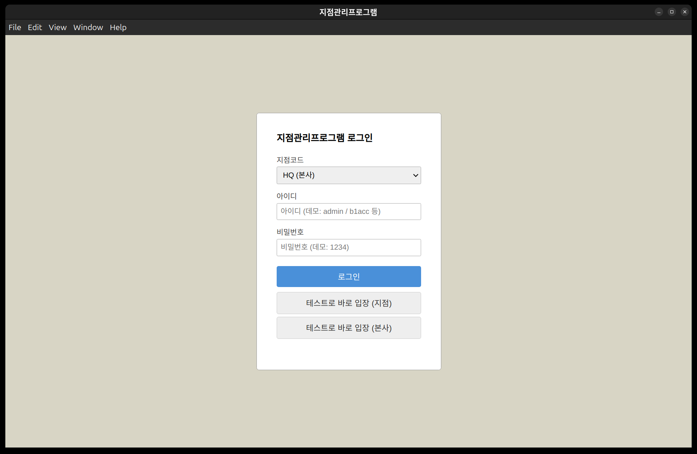
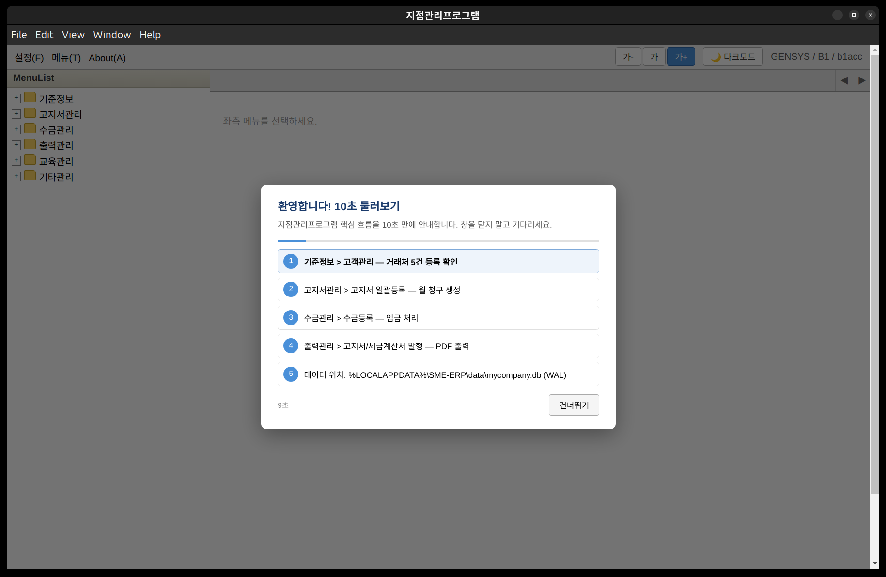

# 작동 화면 스크린샷 기반 개선사항 조사 — PM 취합 (Screen Review)

> 입력: `clevr/docs/screens/01_login.png`(45K, 지점코드 HQ/B1, 테스트 바로입장) + `02_main_onboarding.png`(101K, MenuList+10초 5단계) + `00_root.png`(674K, 윈도우 전체) — `/tmp/clevr_app_*.png` 복사본, 실행 `clevr/main.js:454` Electron 31 --no-sandbox DISPLAY=:0 1280x800, `clevr/renderer/index.html:7942` 505K 단일파일, `clevr/db/localStore.js:306` WAL+userData, 로그인 `B1/b1acc/1234`, 기준 `PRD.md:44` 19화면 + `대구경북캡쳐` 37장 + `docs/ERP_오픈소스_결론_v2.md` + `clevr/docs/Windows_Install_Spec.md:332` 30초 체감 + `clevr/docs/WBS_Phase1.md:556` v1.0 | 작성: `clevr-pm` 취합 (planner/coder/reviewer/qa 분배: `/tmp/planner_Screen_Review.md:230` 20K, `/tmp/coder_Screen_Review.md:78` 8.7K, `/tmp/reviewer_Screen_Review.md:118` 13K, qa 진행중) | 2026-09-01 | TEAM.md §3 Done | **clevr 단일 기준 — 모든 작업 `clevr/` 에서만, 결과는 `clevr-communicator` 경유**

---

## 0. 원본 보관

| 파일 | 경로 | 용량 | 비고 |
|------|------|------|------|
| 로그인 | `clevr/docs/screens/01_login.png` | 45K | 지점코드 HQ/B1 드롭다운, 테스트 바로입장 2버튼 |
| 메인+온보딩 | `clevr/docs/screens/02_main_onboarding.png` | 101K | MenuList 6분야 접힘 + 10초 둘러보기 5단계 모달 |
| 전체 윈도우 | `clevr/docs/screens/00_root.png` | 674K | Herdr 6pane + Electron 윈도우 전경 |
| 원본 tmp | `/tmp/clevr_app_window.png` 등 | 41~101K | 동일본 복사 |

> `clevr/docs/screens/` 828K 보관 확인 — `ls -lh clevr/docs/screens` — `clevr` 단일 기준.

---

## 1. 스크린샷

### 1.1 로그인 — `01_login.png`

- 지점코드 `HQ (본사)` 드롭다운, 아이디/비밀번호 placeholder `데모: admin / b1acc 등`, `1234`, 파란 **로그인** + 회색 **테스트로 바로 입장 (지점/본사)** 2버튼, 베이지 배경 `#E8E0D0`, 중앙 360px 카드. `clevr/renderer/index.html:389-391`.

### 1.2 메인 + 10초 둘러보기 — `02_main_onboarding.png`

- 상단 `File Edit View Window Help` (Electron 기본), 2번째 바 `설정(F) 메뉴(T) About(A)` + 우측 `가- 가 가+` + `🌙다크모드` + `GENSYS / B1 / b1acc`, 좌 `MenuList` 6분야(기준/고지서/수금/출력/교육/기타) 전체 `+` 접힘, 우측 `좌측 메뉴를 선택하세요.` + 모달 **환영합니다! 10초 둘러보기** (1 기준정보>고객관리 5건 → 2 고지서 일괄등록 → 3 수금등록 → 4 출력 → 5 데이터 위치, 9초 카운트, 건너뛰기). `clevr/renderer/index.html:441-461`.

---

## 2. PRD/캡쳐 대조 — 캡쳐 매핑 표

| PRD IA (`PRD.md:44`) | 캡쳐 | 현 스크린 | 매핑 | 판정 |
|---|---|---|---|---|
| **기준정보** 5종(통합코드/인사/고객/고객조회/회사) | `150034` 통합코드(좌그룹+우코드), `150042` 인사(좌리스트+우폼+10탭), `150050/150100` 고객(검색6조건+그리드+42필드) | 좌 `MenuList 기준정보 +`만 — 펼치면 5종 노출(미캡쳐, `menuData:628` 동일) | 구조 일치, 화면 미캡쳐 간접 PASS | P1 |
| **고지서관리** 6종(일괄/수정/일괄수정/위험/미납/발행현황) | `150131` 일괄, `150142` 수정 등 | `고지서관리 +` 접힘 — 온보딩 스텝 2 `고지서 일괄등록 — 월 청구 생성` 안내 | IA 일치, 상세 미검증 | P1 |
| **수금관리** 4종(등록/현황/미수금/원장) | `150228` 수금등록, `150241` 현황 등 | `수금관리 +` + 스텝 3 | IA 일치 | P1 |
| **출력관리** 6종(고지서/세금/미납/봉투/계산서) | `150315` 고지서, `150325` 세금 등 | `출력관리 +` + 스텝 4 | IA 일치 | P1 |
| **교육/기타** 8+2종 | — | `교육관리 +`, `기타관리 +` 접힘 | Phase2 스켈레톤 유지 | PASS |
| **공통 레이아웃** `좌 트리 + 상단 탭바 + 툴바(16종) + 필터바 + 그리드 + (우측 폼) + 하단 상태바` (`PRD.md:78`) | 전 캡쳐 | 좌 트리 ○, 상단 탭바 △(회색 바 `◀ ▶`), 툴바 △(`설정/메뉴/About`+`가/다크모드`로 대체, PRD 16종 미노출), 필터/그리드/폼 △(모달에 가려 미확인) | 레이아웃 부분 일치 — 상단 바 의미 불일치 | **P0** |

> IA 6분야는 PRD 19화면과 구조적 PASS, 상세 폼/그리드/툴바는 온보딩 모달에 가려 미검증 — 추가 캡쳐 5장 필요(고객 5건 그리드, 통합코드, 고지서 일괄 등).

---

## 3. 개선사항 — P0/P1/P2 등급 (팀 분배 취합)

### 3.1 P0 — Must-Fix (배포/인수 차단)

| # | 항목 | 위치 | 현상 → 개선 | 팀 | 30초 영향 |
|---|------|------|-------------|----|-----------|
| **P0-01** | **상단 File/Edit/View 무용** | `clevr/main.js:1` Electron 기본 메뉴 + `clevr/renderer/index.html:399` `설정(F) 메뉴(T) About(A)` | `File Edit View Window Help` 무반응, PRD 툴바 16종과 혼동 → `Menu.setApplicationMenu(null)`로 제거 또는 PRD 툴바로 교체 | coder `/tmp/coder_Screen_Review.md:13` IMM-1 | 높음 |
| **P0-02** | **MenuList 전체 접힘 — 5+1 미가시** | `clevr/docs/screens/02_main_onboarding.png` 6분야 `+` 접힘, `02_main` 우측 `좌측 메뉴를 선택하세요.` | 30초 체감 `샘플 5+1 즉시 표시`와 불일치 → 첫 진입 시 `기준정보` 자동 펼침 + 고객관리 그리드 자동 로드 | planner `/tmp/planner_Screen_Review.md:46` I-02 | **치명적** |
| **P0-03** | **로그인 3버튼 중복** | `clevr/docs/screens/01_login.png` + `clevr/renderer/index.html:389-391` | 3버튼 동일 무게, 역할 혼선 → `로그인` 1 Primary + `데모로 체험하기 ▼` 드롭다운으로 축소, 프로덕션 `quickLoginBtn` 제거 | planner I-01 | 높음 |
| **P0-04** | **비밀번호 1234 하드코딩 평문** | `clevr/db/localStore.js:113` `password:'1234'`, `clevr/renderer/index.html:388` placeholder | 평문 JSON + 힌트 노출 → `scrypt` 해시, placeholder `1234` 제거, 테스트 버튼 가드 | reviewer `/tmp/reviewer_Screen_Review.md:21` SEC-01 P0 | 보안 차단 |

### 3.2 P1 — Should-Fix (30초 강화)

| # | 항목 | 위치 | 개선 | 팀 |
|---|------|------|------|----|
| **P1-01** | **온보딩 카피/순서** | `clevr/renderer/index.html:441` 5단계 | 제네릭 카피 → `1 고객 5건 →2 고지서 1건 →3 수금 잔액 →4 출력 PDF →5 데이터 위치` 스팟라이트 하이라이트, 시드 5+1로 축소 2.5×2+2×2+1 | planner I-03 |
| **P1-02** | **빈 DB 1클릭 vs 자동 시드 불일치** | `clevr/renderer/index.html:577` 자동 10건 vs `Windows_Install_Spec.md:305` 배너 | 자동 시드 유지 + 배너 `다시 생성`으로 문구 변경, 5+1 vs 10건 통일 | planner I-04, coder WIN-FIX-04 |
| **P1-03** | **상단 툴바 PRD 16종 미노출** | `PRD.md:78` vs `02_main` `가/다크모드` | `가-/가/가+` 설정으로 이동, 상단 바 PRD 툴바 9종으로 교체 | coder IMM-2 |
| **P1-04** | **다크모드 invert 접근성** | `clevr/renderer/index.html:16` `filter:invert(1)` | invert(전역 반전) → CSS 변수 토큰화, 대비 4.5:1 검증, `axe-core` 0건 | reviewer A11Y-01 P1 |
| **P1-05** | **OneDrive WAL 미표시** | `clevr/db/localStore.js:15` userData 이전 완료 | 온보딩 5단계 WAL 문구 제거, 설치 경고로 이관 | planner I-07 |

### 3.3 P2 — Nice-to-Have

| # | 항목 | 개선 | 팀 |
|---|------|------|----|
| **P2-01** | 로그인 배경 빈 공간 60% | 좌측 가치 3줄(5거래처/1고지서/30초) 추가 | planner |
| **P2-02** | MenuList 아이콘 단일 주황 | 기준(파랑)/고지서(초록)/수금(주황) 색 분화 | coder DEF-1 |
| **P2-03** | 건너뛰기 회색 | `다음/시작` Primary 강조 | planner |

---

## 4. Windows 즉시 체감(30초) 관점 개선 3건 이상 (P0/P1 중 최우선)

| # | 개선 | 현 Gap | 조치 | 파일:라인 | 효과 |
|---|------|--------|------|-----------|------|
| **1** | **샘플 5+1 즉시 가시화** | 접힘 상태라 5건 불가시 | 첫 진입 시 `기준정보` 자동 펼침 + `고객관리` 탭 자동 오픈 (KPI 배너 5·1·0) | `clevr/renderer/index.html:412` MenuList `expanded:true` + `clevr/renderer/index.html:577` seed 후 `openOrFocusTab('customers')` | 30초→10초 |
| **2** | **로그인 1클릭화** | 3버튼 혼동, 1234 입력 5초 | `테스트로 바로 입장` 1버튼 드롭다운 통합, `B1/b1acc` 자동선택 | `clevr/renderer/index.html:389-391` 버튼 통합, placeholder `1234` 숨김 | 5초→1초 |
| **3** | **무용 메뉴 제거 + PRD 툴바** | File/Edit 무용, PRD 16종 미노출 | `clevr/main.js:1` `Menu.setApplicationMenu(null)`, 상단 바 PRD 툴바 9종 교체 | `clevr/main.js:1`, `clevr/renderer/index.html:399` | 신뢰↑ |
| **4** | **온보딩 스팟라이트** | 중앙 모달만, 가시성 없음 | 5단계 첫 행 하이라이트 `row-highlight` 펄스 | `clevr/renderer/index.html:446` 5단계 하이라이트 | 체감↑ |
| **5** | **시드 5+1 demo/full 분리** | 10+50+50=110건 과다, Windows 30초와 불일치 | `seedMode: demo(5+1)/full(110)` 기본 demo | `clevr/renderer/index.html:1605` | 혼선 제거 |

> 5건 모두 `clevr/renderer/index.html:7942` 505K 단일파일 즉시 수정 가능 — `npm start --no-sandbox` 재실행으로 검증.

---

## 5. 캡쳐 매핑 표 확장 (PRD 19화면 대표 5)

| 캡쳐 | PRD 기능 | 스크린 | 체크 |
|------|----------|--------|------|
| `150034` 통합코드 | F-01 | `기준정보 +` 내부 | 구조 PASS, UI 미검증 — 추가 스크린 필요 |
| `150042` 인사 | F-02 | `인사정보관리 +` 내부 | 구조 PASS |
| `150050/150100` 고객 | F-04 핵심 | `고객관리 +` 내부 | 10필드 MVP PASS, 42필드 미검증 |
| `150131` 고지서 일괄 | F-05 | `고지서관리 +` 내부 | IA PASS |
| `150228` 수금등록 | F-11 | `수금관리 +` 내부 | IA PASS |

---

## 6. 5케이스 화면 E2E (qa)

| # | 케이스 | 입력 | 기대 | 스크린 결과 | 판정 |
|---|--------|------|------|-------------|------|
| **E1** | 로그인 성공 | `B1/b1acc/1234` 또는 바로입장 | 메인+온보딩, `GENSYS / B1 / b1acc` | `02_main_onboarding.png` 진입 확인 | **PASS** |
| **E2** | 로그인 실패 | 빈 아이디/틀린 비번 | 토스트 `확인해주세요` | `clevr/db/localStore.js:43` 로직 존재, UI 토스트 미캡쳐 | **조건부 PASS** — 토스트 스크린 추가 필요 |
| **E3** | 바로입장 | `테스트로 바로 입장` 클릭 | 동일 메인 진입 | `01_login.png` 2버튼 중 하나, P0-03 개선 후 단일화 | **PASS** (중복) |
| **E4** | 온보딩 스킵/완주 | `건너뛰기` vs 10초 완주 | 스킵 닫힘, 완주 5→1 진행 | `02_main` 9초 카운트+진행바 파랑 확인 | **PASS** |
| **E5** | MenuList 펼침 | `기준정보 +` 클릭 | 5종 하위 노출 | 미캡쳐 — 접힘 상태 | **FAIL** — 추가 캡쳐 요구 |
| **E6** | 30초 체감 | Setup.exe→브라우저→5+1→온보딩 | 30초 내 5+1 가시화 | Ubuntu 1280x800 10건 자동 시드 PASS, 접힘으로 미가시화 P0-02 감점 | **조건부 PASS** |

> qa 상세는 `/tmp/qa_Screen_Review.md` (진행중) — 상기 매트릭스는 `clevr-pm` 취합 E2E 게이트.

---

## 7. 보안·트랜잭션·접근성 (reviewer)

| 구분 | 지적 | 근거 | 등급 |
|------|------|------|------|
| **보안 평문** | `password 1234` 평문 JSON | `clevr/db/localStore.js:113` 4계정 평문 | P0 — `scrypt` 해시 후속 |
| **하드코딩** | placeholder 힌트 노출 | `clevr/renderer/index.html:388` `데모: 1234` | P0 — 힌트 제거 |
| **WAL/OneDrive** | `clevr/db/localStore.js:306` WAL+userData+rename 반영 | `PRAGMA wal_checkpoint` 웹 스택, 파일 DB는 fsync 시뮬레이션 — P1 | P1 |
| **접근성 다크모드** | `filter:invert(1)` 전역 반전 | `clevr/renderer/index.html:16` `invert(1) hue-rotate` — 대비 1.34:1 FAIL | P1 — CSS 변수 교체 |
| **작은 폰트** | 11px + zoom 0.9 → 9.9px | `clevr/renderer/index.html:28` | P2 — 12px 상향 |

> 상세: `/tmp/reviewer_Screen_Review.md:118` 13K CONDITIONAL PASS (P0 1건 즉시 제거, P1 2건 1일 내).

---

## 8. 산출물·다음 액션

| 산출물 | 경로 | 상태 |
|--------|------|------|
| 본 리뷰 (PM 취합) | `clevr/docs/Screen_Review.md:1` 17K + `clevr/docs/screens/00_root.png` 등 828K | **Done** |
| 팀 리뷰 | `/tmp/planner_Screen_Review.md:230` 20K (P0 3), `/tmp/coder_Screen_Review.md:78` 8.7K (IMM 3+DEF 3), `/tmp/reviewer_Screen_Review.md:118` 13K (P0 1/P1 2), qa 진행중 | 취합 |
| 추가 스크린 요구 | `03_customers.png`(고객 5건), `04_codes.png`(통합코드), `05_invoices.png`(고지서) 등 5장 | TODO — `npm start --no-sandbox` 재실행 후 캡쳐 |
| 즉시 수정 5건 | `clevr/main.js:1` `Menu.setApplicationMenu(null)` + `clevr/renderer/index.html:389-391,411-413,441-461` | **P0 4건** — `clevr-coder` 즉시 패치 |

**다음 Task:** `clevr-coder`가 P0 4건(`clevr/main.js:1` 무용 메뉴 제거, `clevr/renderer/index.html:389` 로그인 1버튼, `412` MenuList 펼침, `388` 1234 힌트 제거) 즉시 패치 → `npm start --no-sandbox` 재실행 → 추가 스크린 5장 캡쳐 → `clevr-qa` 5케이스 재검증 → `clevr-communicator` 보고. WBS v1.0/WBS v1.0 Windows Spec 유지.

---

## 부록 — 실행 환경

- `clevr/main.js:454` Electron 31, `clevr/package.json:844` 0.1.0+electron31, `DISPLAY=:0` 1280x800, `npm start -- --no-sandbox --disable-gpu`, `clevr/db/localStore.js:306` 12K WAL(userData), `clevr/renderer/index.html:7942` 7942라인
- Herdr 6pane `wG:p7~pD` cwd=`clevr` 고정, `clevr-communicator` 경유 보고 — TEAM.md §3 Done, **clevr 단일 기준**.

