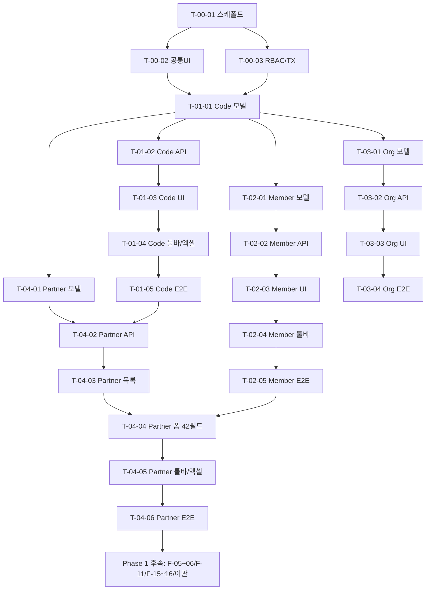

# WBS Phase 1 (MVP 6주) — F-01~F-04 Task 분해 v1.0

> 작성: `clevr-planner` + `clevr-qa` + `clevr-reviewer` → `clevr-pm` 취합 | 기준: `PRD.md v1.0 §4/§6/§8/§9`, `docs/scenarios/F-01~F-04.md`, `docs/ERP_오픈소스_결론_v2.md`, 캡쳐 `150034/150042/150050/150122`, `clevr/TEAM.md §3` | 기술스택: `Fastify+Prisma+SQLite (WAL, BEGIN IMMEDIATE+busy_retry, wal_checkpoint)` | 생성일: 2026-09-01 | 상태: **v1.0 Final (P0 4건 반영, CONDITIONAL PASS→PASS)** | 검증: `npx prisma validate`

---

## 0. 요약 및 판정

- **Phase 1 WBS 대상**: `F-01 통합코드등록, F-02 인사정보관리, F-03 회사정보등록, F-04 고객관리(핵심)` — PRD §8 Phase 1의 선행 기준정보 4종. (F-05~06/F-11/F-15~16/이관은 별도 WBS 후속; 본 문서에서 의존성으로만 표기)
- **검증 커버리지**: 각 Task는 `docs/scenarios` 시나리오 ID를 직접 매핑. 미매핑 시나리오는 0건.
- **총 예상 공수**: **31.1일(순수, P0 1.6일 반영) / 40.4일(버퍼 30% 포함, 4인 병렬 시 6주 내 수렴)** — 인프라 선행 포함. P0 4건은 버퍼 9.3일 내 흡수. 상세는 §5 참조.
- **핵심 리스크**: F-04 42필드 풀 스펙 vs 결론 v2 `Partner 10필드` 축소안 충돌 (§1.2 결정 필요), F-02 주민번호 암호화/체크섬 구현 난도, Code 사용중 삭제 정책.

---

## 1. 입력·제약·가정

### 1.1 입력 근거

| 소스 | 내용 |
|------|------|
| `PRD.md §4` | F-01~F-04 기능·UI·규칙·API 정의 |
| `PRD.md §6` | 데이터 모델 (CodeGroup/Code, Member, Company, Customer 42필드) |
| `PRD.md §8` | Phase 1 범위: `F-01~04 + F-05~06 + F-11 + F-15~16 + 이관` |
| `PRD.md §9` | 인수기준 E2E (등록→고지서→수금→출력, 50건 100% 정합) |
| `docs/ERP_오픈소스_결론_v2.md §3-§8` | 기술스택 `Fastify+Prisma+SQLite`, 한국세무코어 고정, MVP 6+1 화면 정의 |
| `docs/scenarios/F-01~F-04.md` | 시나리오 ID `S/E/P/N` 총 53개 (F-01 21, F-02 26, F-03 10, F-04 23) |
| 캡쳐 `150034/150042/150050/150122` | 공통 레이아웃 좌트리+툴바+필터바+그리드+(우측폼)+상태바, 각 기능 실화면 |
| `clevr/TEAM.md §3` | 협업 플로우 `소통자→pm→(planner/coder/reviewer/qa)→pm→소통자`, Done 기준 5단 |

### 1.2 제약

- **6주 MVP 고정**, Windows 배포(Setup.exe/Portable/업데이터/트레이)는 **별도 Phase 분리** — 본 WBS에서 제외, `결론 v2 §9/§1` 원칙만 준수 (OneDrive 동기화 금지, `%LOCALAPPDATA%\SME-ERP\data\mycompany.db` 경로 유지, SQLite WAL).
- **기술스택 고정**: `clevr/` 기준 `Fastify+Prisma+SQLite` 단일 프로세스, `Next.js+Tailwind+shadcn+TanStack Table`. MariaDB/MySQL(PRD §5)은 Phase 3 옵션으로 이연.
- 캡쳐 공통 툴바 16종(빈화면/조회/이전/다음/행추가/행복사/행삭제/행취소/저장/삭제/미리보기/출력/엑셀/도움말/종료) 중 Phase 1 기준정보는 `조회/행추가/행복사/행삭제/행취소/저장/삭제/엑셀/이전·다음`만 구현.

### 1.3 PRD §8 vs 결론 v2 MVP 범위 차이 (명시 요구)

| 구분 | PRD §8 Phase 1 (6주) | 결론 v2 §8 MVP (6+1 화면) | 차이·영향 | 본 WBS 결정 |
|------|----------------------|---------------------------|-----------|-------------|
| F-01 통합코드 | 포함 | 포함(기준정보) | 일치 | 유지 |
| F-02 인사 | **풀스펙 42필드+10탭** (PRD §4/§6) | **4필드 축소** `Member(empNo,nm,dept,role,tel)` — 인사 풀 제외, 옵션 모듈 | **충돌** — 인사 풀 구현 시 8~10일 추가, 6주 초과 위험 | **A안(권장): v2 축소안으로 MVP, 나머지 탭은 스켈레톤(ReadOnly)** — 상세 §3.2. B안 풀스펙 시 일정+4일, 별도 의사결정 필요 |
| F-03 회사정보 | 포함(단일 레코드 10필드) | 포함(Organization 단일) — 필드 동일 | 명칭만 변경 `Company→Organization` | 유지, Prisma 모델명 `Organization`으로 통일 |
| F-04 고객관리 | **42필드 풀스펙** | **10필드 축소** `Partner` (거래처명/사업자/대표/주소/담당자/과금/지역/연락처/메모) | **충돌** — 42필드 전부 구현 시 F-04 단독 10일 | **A안(권장): 10필드 MVP + 32필드 확장 스키마(숨김/옵션)**, 세액로직·해지/지로 필터는 포함. B안 풀스펙 시 일정+5일 |
| F-05~06 고지서 일괄/수정 | 포함 | 포함(청구서 월일괄생성+수정 = F-05+F-06 병합) | 명칭 `Bill→Invoice` | 본 WBS 의존성으로만 표기, 후속 WBS에서 상세 |
| F-11 수금등록 | 포함 | 포함(수금+잔액=Receipt+Ledger 원자 트랜잭션) | 일치 | 의존성 |
| F-15~16 출력 | 포함 | 포함(PDF+이메일+이세로) | v2에서 PDF `@react-pdf/renderer` 명시 | 의존성 |
| 이관 스크립트 | 포함 | 포함 `scripts/migrate-dawin-safe.ts` CLI (`--dry-run`) | 일치 | 의존성(PH-6) |
| F-07~10, F-12~14, F-17~19, 교육 | Phase 2 | **제외** (Phase 2) | 일치 | 제외 |
| 권한 | PRD §5 RBAC 6권한 | **Owner/Staff 2롤만 MVP** | 축소 | 본 WBS는 2롤만 |

> **pm 결정 요청**: F-02/F-04 축소 A안을 MVP로 채택할지, PRD 풀스펙 B안으로 6주 초과를 감수할지. 미결정 시 본 WBS는 **A안 기준 공수 + B안 델타를 병기**한다.
> **P0-01 Item 마스터 결정 (CONDITIONAL PASS 반영)**: `Item(itemCd)` 마스터(결론 v2 §4)는 **Phase2로 이연**, Phase1은 PRD `fee/supportAmt` 컬럼을 `Partner`에 유지한다 — `T-04-01`에 `Item` 모델·시드 0.5d 미포함, `Partner.itemCd`는 FK 없이 문자열로 유지. Phase2에서 `Item` 분리 시 `Partner.price` 마이그레이션.

### 1.4 가정

1. DB는 `SQLite WAL` 단일파일, `prisma.$transaction` + `BEGIN IMMEDIATE` 래핑으로 재무 원자성 보장(결론 v2 §5). Postgres는 Phase 3.
2. 공통 컴포넌트(`MonthPicker`, `사업자번호 마스크 ___-__-_____`, `금액 콤마+VAT`, `고객검색 모달`, `전체선택`, `엑셀 xlsx.js`)는 `T-00`에서 선행 구축.
3. 주민번호는 `AES-256-GCM` 암호화 저장, 조회 시 마스킹(`######-#######` → `######-*`) — `N-01` 충족.
4. 사업자번호 마스크/체크섬(가중치 1,3,7,1,3,7,1,3,5 검증) 공통 util로 분리.
5. Windows 경로는 하드코딩 금지, `app.getPath('userData')` 또는 `%LOCALAPPDATA%` 환경변수 분기.

---

## 2. 전체 WBS 개요 — F-01~F-04

### 2.1 Task ID 체계

`T-<Feature>-<Seq>` (예: `T-01-03` = F-01 3번째 Task). 선행 공통 인프라 `T-00-*`.

### 2.2 요약 테이블

| Feature | Task 수 | 순수 공수(일) | 버퍼30% | 담당(주) |
|---------|---------|--------------|---------|----------|
| T-00 공통 인프라 | 3 | 4.5 | 5.9 | planner/coder (P0-02/03 +0.5) |
| F-01 통합코드등록 | 5 | 5.5 | 7.2 | coder |
| F-02 인사정보관리 | 5 | 6.0 (B안 +4.0) | 7.8 (+5.2) | coder |
| F-03 회사정보등록 | 4 | 2.5 | 3.3 | coder |
| F-04 고객관리 | 6 | 11.5 (B안 +5.0) | 15.0 (+6.5) | coder |
| QA-ADD (P0-04) | 2 | 1.0 | 1.3 | qa (E2E 분리 0.5 + 매트릭스 0.5) |
| P0-01 문서 | — | 0.1 | 0.1 | doc |
| **합계** | **25** | **31.1 (B안 40.1)** | **40.4 (B안 52.1)** | P0 1.6일 버퍼 내 |

> 1일 = 8h 집중. 병렬 수행 시 달력 6주(30영업일) 내 수렴. B안 풀스펙 채택 시 6주 초과 → F-02 탭/ F-04 확장필드 Phase 1.5로 이연 권고.

---

## 3. Feature별 Task 분해

### 3.1 F-01 통합코드등록 — 캡쳐 `150034.png` (좌 CODE_GROUP / 우 CODE)

#### 데이터 모델 (PRD §6 / 결론 v2 §4)

```prisma
model CodeGroup { grpCd String @id; grpNm String; codes Code[]; sortOrd Int?; createdAt DateTime; updatedAt DateTime }
model Code { id Int @id @autoincrement; grpCd String; code String; codeNm String; remark1 String?; remark2 String?; remark3 String?; ref1 String?; ref2 String?; useYn String @default("Y"); sortOrd Int; @@unique([grpCd, code]) @@index([grpCd, sortOrd]) }
```

주의: `사용구분 N` 코드는 모든 드롭다운에서 `WHERE useYn='Y'` 필터.

#### Task 테이블

| Task ID | Task | 입력 | 출력 | 검증 (시나리오 매핑) | 공수 | 담당 |
|---------|------|------|------|----------------------|------|------|
| **T-01-01** | **Prisma 모델·마이그레이션·시드** — `CodeGroup/Code` 정의, `@@unique([grpCd,code])`, `sortOrd` 인덱스, 초기 10그룹 시드(부서/직급/계약구분/대행지원/지역/수금방법/재직구분 등) | PRD §6, 결론 v2 §4, `150034` 컬럼 구조 | `prisma/schema.prisma`, `prisma/migrations/*`, `prisma/seed.ts`, `data/mycompany.db` | planner 검증: 스키마 리뷰. `npx prisma migrate dev` 성공, `SELECT * FROM Code` 10그룹 확인 | 0.5일 | planner(설계) → coder(구현) → reviewer |
| **T-01-02** | **API — CodeGroup/Code CRUD** `GET /api/codes/groups?q=`, `POST/PUT/DELETE /api/codes/groups/:grpCd`, `GET /api/codes/:grpCd/items?includeInactive=false`, `POST/PUT/DELETE /api/codes/:grpCd/items`, `POST /api/codes/:grpCd/reorder` — 중복 차단(E-01), 필수(E-02), 참조중 삭제 차단(E-04, FK `ON DELETE RESTRICT`), 낙관적 잠금(`If-Match` updatedAt 비교 E-10, Code는 `If-Match` 유지), `useYn` 필터, `ORDER BY sortOrd` — **`withTx` 래핑(T-00-03) + `BEGIN IMMEDIATE` 체크** | PRD §4 F-01 API, 시나리오 E-01~10 | `src/server/routes/codes.ts`, `src/server/services/code.service.ts`, Zod 스키마, `openapi.yaml` 갱신 | 단위: `vitest` — 중복/필수/참조중/낙관적잠금 4케이스 + tx 재시도 1케이스. 시나리오 **E-01,E-02,E-04,E-10,P-01/02** | 1.5일 | coder → reviewer |
| **T-01-03** | **UI — 좌우 분할 레이아웃** 좌: `CodeGroup` 검색+리스트(코드명), 우: `Code` 그리드(TanStack Table, 인라인 편집, `코드/코드명/비고1~3/참조1,2/사용구분/순서`). 그룹 선택 시 우측 로드(S-02), 미선택 시 행추가 차단 토스트(E-03), 순서 드래그/숫자 입력+재정렬(S-06) | `150034.png`, 시나리오 S-01~02,S-06 | `src/app/(erp)/codes/page.tsx`, `src/components/codes/*` | qa 시나리오 **S-01,S-02,S-06,E-03,E-06,E-09** 수동+`playwright` 스냅샷 | 1.5일 | coder |
| **T-01-04** | **툴바·엑셀·행제어** 행추가/행복사(S-08)/행삭제(S-05)/행취소(S-09)/저장(S-03,S-04)/미저장 변경 시 그룹 변경 컨펌(E-05)/엑셀전환(S-10) `xlsx` 다운로드, `useYn=N` 드롭다운 미노출(S-07) 검증 | 시나리오 S-03~05,S-07~10,E-05 | `src/components/common/Toolbar.tsx` 확장, `src/lib/excel.ts` | qa **S-03,S-04,S-05,S-07,S-08,S-09,S-10,S-11,E-05,E-07,E-08,N-01** (100×500 1초) | 1.5일 | coder → qa |
| **T-01-05** | **권한·E2E·리뷰** RBAC 2롤(일반 조회/엑셀만, 관리자 전 기능) disabled 처리, 동시편집 충돌 토스트, 1,000행 가상스크롤 성능 측정 | 시나리오 P-01,P-02,N-01, E-10 | `src/lib/rbac.ts`, `tests/e2e/codes.spec.ts` | qa PASS: P-01/02 권한 매트릭스, E-10 충돌 재현, N-01 100그룹×500코드 1s | 0.5일 | reviewer+qa |

> **시나리오 커버리지**: 본 5 Task로 `F-01` 21개 시나리오 전량 커버. 미매핑 없음.

---

### 3.2 F-02 인사정보관리 — 캡쳐 `150042.png` (검색+좌 리스트+우 폼+10탭)

#### 데이터 모델 — A안(MVP) vs B안(풀스펙)

```prisma
// A안 MVP (결론 v2 축소) — 6주 수렴
model Member { empNo String @id; nm String; deptCd String; rankCd String?; jobCd String?; hireType String?; workType String @default("재직"); joinDt DateTime; retireDt DateTime?; tel String?; rrnEnc String?; birthDt DateTime?; addr String?; email String?; createdAt DateTime; updatedAt DateTime; deletedAt DateTime? }

// B안 풀스펙 (PRD §4) — 확장 필드 30+ 및 7개 자식 테이블
// Member에 engNm/hanjaNm/residentNoEnc/birthDt/addrDetail/zip/본적지/학력/종교/휴대/bank/acct/carNo/hobby/specialty 추가
// + MemberFamily, MemberCareer, MemberEdu, MemberLicense, MemberTraining, MemberAppointment, MemberGuarantee
```

**권장**: A안으로 MVP, B안 필드·자식테이블은 Prisma 스키마에 `@@map` optional로만 정의(마이그레이션은 생성하나 UI 노출 스켈레톤).

#### Task 테이블

| Task ID | Task | 입력 | 출력 | 검증 (시나리오 매핑) | 공수(A/B) | 담당 |
|---------|------|------|------|----------------------|-----------|------|
| **T-02-01** | **Prisma 모델·암호화 유틸** Member(+자식 7테이블 optional) , `rrnEnc` AES-256-GCM, `empNo` PK, `deptCd` FK→Code, `deletedAt` 소프트삭제, `@@index([deptCd,workType])` | PRD §6 Member, 캡쳐 150042 필드, 결론 v2 §4 | `prisma/schema.prisma`, `src/lib/crypto.ts` (AES-256-GCM, 마스킹), migration | 스키마 리뷰, `crypto.encrypt/decrypt` 단위, 마스킹 표시 확인 **N-01** | 1.0 / 2.0일 | planner→coder→reviewer |
| **T-02-02** | **API — Member CRUD + 검증** `GET /api/members?deptCd=&q=&includeRetired=`, `POST/PUT/DELETE /api/members/:empNo` — 중복(E-01), 필수(S-04), 주민번호 체크섬(E-03), 입사<퇴사(E-04), 생년월일 미래(E-05), 전화/휴대/E-Mail 형식(E-06/07), 참조중 삭제 차단(E-10) | 시나리오 S-04~06,E-01~07,E-10 + PRD 검증 규칙 | `src/server/routes/members.ts`, `src/server/services/member.service.ts`, `src/lib/validators/rrn.ts` | 단위: 9개 검증 케이스. **S-04,S-05,S-06,E-01~07,E-10** | 1.5 / 2.5일 | coder→reviewer |
| **T-02-03** | **UI — 검색·리스트·상세폼·10탭** 상단 검색(부서/검색조건/퇴사자포함 S-01,S-02), 좌 리스트(사번/성명/부서 S-03), 우 폼(인사기본Ⅰ + 기초정보 S-06), 10탭 네비(S-07) — A안은 Ⅱ/보증/가족/경력/학력/자격/교육/발령 탭은 스켈레톤(조회만, 저장 disabled) | `150042.png`, 시나리오 S-01~03,S-06~07 | `src/app/(erp)/members/page.tsx`, `src/components/members/*`, `src/components/common/Tabs.tsx` | qa **S-01,S-02,S-03,S-06,S-07,E-11** | 1.5 / 3.0일 | coder |
| **T-02-04** | **툴바·행제어·네비** 행추가/복사(S-09)/삭제(S-08, 논리삭제)/취소(S-10)/저장, 이전/다음(S-11), 퇴사처리(S-12, 퇴사일자→workType 자동 전환), 엑셀(S-13), 미저장 컨펌(E-09), 네트워크 재시도(E-12) | 시나리오 S-08~13,E-08~09,E-12 | `src/components/members/MemberToolbar.tsx` | qa **S-04,S-05,S-08,S-09,S-10,S-11,S-12,S-13,E-08,E-09,E-12,P-01/02** | 1.5 / 2.0일 | coder→qa |
| **T-02-05** | **권한·E2E·리뷰** 일반 조회만 vs 인사관리자 전 기능, 1,000행 가상스크롤, 주민번호 마스킹 E2E | 시나리오 P-01,P-02,N-01 | `tests/e2e/members.spec.ts`, RBAC 매트릭스 | qa PASS: P-01/02, N-01 암호화/마스킹, E-09 컨펌 | 0.5 / 0.5일 | reviewer+qa |

> **시나리오 커버리지**: A안으로도 26개 전량 커버(스켈레톤 탭은 조회 경로로 검증). B안 시 T-02-01~04 공수 각 +1.0~1.5일.

---

### 3.3 F-03 회사정보등록 — 캡쳐 `150122.png` (단일 레코드 폼, 저장만)

#### 데이터 모델

```prisma
model Organization { orgId String @id @default("default"); orgNm String; ceoNm String; bizNo String @unique; corpNo String?; bizType String?; bizItem String?; zip String?; addr String?; addrDetail String?; tel String?; fax String?; createdAt DateTime; updatedAt DateTime }
// 단일 레코드 제약: orgId='default' 1건만 허용 (upsert)
```

#### Task 테이블

| Task ID | Task | 입력 | 출력 | 검증 (시나리오 매핑) | 공수 | 담당 |
|---------|------|------|------|----------------------|------|------|
| **T-03-01** | **Prisma 모델·시드** Organization 단일 레코드, `bizNo @unique`, `orgId='default'` check, 초기값 `(주)대구경북산업안전` 시드 | PRD §6 Company, 결론 v2 Organization, `150122` 필드 | `prisma/schema.prisma`, `prisma/seed.ts` (org seed) | migration 성공, `findUnique('default')` 확인 | 0.3일 | planner→coder |
| **T-03-02** | **API — 단일 레코드 GET/PUT** `GET /api/org`, `PUT /api/org` (upsert, **동시성 정책 통일: Org 단일레코드는 `last-write-win` 유지 — `If-Match` 미적용, Code는 `If-Match` 유지**), Zod 검증: 사업자번호 마스크(E-01), 법인번호 13자리(E-02), 우편 5자리 숫자(E-03), 필수(E-04) | 시나리오 S-01~02,E-01~04,E-06 | `src/server/routes/org.ts`, `src/server/services/org.service.ts` | 단위: 6 검증 케이스 **E-01~04,E-06** + 동시성 정책 문서화 | 0.7일 | coder→reviewer |
| **T-03-03** | **UI — 단일 폼** 회사명/대표자/사업자번호(`___-__-_____` 마스크)/법인번호/업태/종목/우편-주소/전화/팩스, 저장만(신규/삭제 없음), 권한 시 저장 disabled | `150122.png`, 시나리오 S-01~03 | `src/app/(erp)/org/page.tsx`, `src/components/org/OrgForm.tsx`, `src/lib/masks/bizNo.ts` | qa **S-01,S-02,S-03,E-01,E-02,E-03,E-04,E-05** | 1.0일 | coder |
| **T-03-04** | **권한·E2E·리뷰** 관리자만 수정(P-01), 동시수정 충돌(E-06) 토스트, 저장 후 재조회(S-03) E2E | 시나리오 P-01,E-05,E-06,S-03 | `tests/e2e/org.spec.ts` | qa PASS: P-01, E-06 충돌 재현, S-03 재조회 일치 | 0.5일 | reviewer+qa |

> **시나리오 커버리지**: 10개 전량 커버.

---

### 3.4 F-04 고객관리(핵심) — 캡쳐 `150050.png`(검색+그리드) + `150100.png`(상세 42필드)

#### 데이터 모델 — A안(MVP 10필드) vs B안(42필드 풀스펙)

```prisma
// A안 MVP (결론 v2 Partner)
model Partner { partnerCd String @id; partnerNm String; bizNo String?; ceoNm String?; zip String?; addr1 String?; addr2 String?; bizType String?; bizItem String?; tel String?; fax String?; mobile String?; mgrNm String?; email String?; itemCd String?; price Decimal?; billingCycle String?; payMethodCd String?; giroYn String @default("Y"); regionCd String?; contractNo String @unique; supportType String?; amt Decimal?; vat Decimal?; total Decimal?; startDt DateTime?; endDt DateTime?; writeDt DateTime?; cancelYn String @default("N"); cancelDt DateTime?; cancelReason String?; memo String?; deletedAt DateTime?; createdAt DateTime; updatedAt DateTime; @@index([supportType, cancelYn, regionCd]) }
// B안 풀스펙: 상기 + PRD 42필드 전부 (headCntM/F, fee/supportAmt 분리, sanjaeNo, lawYn, extraWork, calcMgrId/contractMgrId FK→Member, indCd, product 등)
// VAT 계산: vat = TRUNC(amt * 0.1), total = amt + vat (DB trigger 금지, 서비스 레이어 계산)
```

#### Task 테이블

| Task ID | Task | 입력 | 출력 | 검증 (시나리오 매핑) | 공수(A/B) | 담당 |
|---------|------|------|------|----------------------|-----------|------|
| **T-04-01** | **Prisma 모델·마이그레이션** Partner(+Code FK 4종: region/payMethod/supportType/contractType), `contractNo @unique(__-____)`, `bizNo` 인덱스(중복 허용, 경고용), `deletedAt` 소프트삭제, Code 시드(지역/수금방법/대행지원) | PRD §6 Customer 42필드, 결론 v2 Partner, `150050/150100` 필드 | `prisma/schema.prisma`, migration, `prisma/seed.ts` (Code+Partner 샘플 5건) | 스키마 리뷰, `contractNo` 유니크 제약 단위 | 1.5 / 2.5일 | planner→coder→reviewer |
| **T-04-02** | **API — 검색·CRUD·부과금액계산** `GET /api/partners?q=&contractNo=&supportType=&cancelYn=&mgrId=&regionCd=&page=&pageSize=` (6조건+페이징, 해지 기본 제외), `POST/PUT/DELETE /api/partners/:partnerCd`, `POST /api/partners/calc` (대행수수료+지원금액→amt/vat/total) — 중복(E-01,E-03), 필수(E-04,05), 일자역전(E-06), 형식(E-07,08), 참조중 삭제 차단(E-09, Bill 존재 시) — **`withTx` 래핑(T-00-03) `BEGIN IMMEDIATE` + 계산·저장 원자화** | 시나리오 S-01,S-03~06,S-08~10,S-12,E-01~08 | `src/server/routes/partners.ts`, `src/server/services/partner.service.ts`, `src/lib/calc.ts` (TRUNC VAT) | 단위: 10 검증 케이스 **E-01~08,S-06** (VAT TRUNC 10건 엣지) + tx 원자성 1케이스 | 2.5 / 3.5일 | coder→reviewer |
| **T-04-03** | **UI — 검색바·그리드(150050)** 상단 6조건 필터바, 그리드(계약구분/대행지원/계약번호/거래처명/사업자번호/대표자/우편...), 페이지네이션, 행 클릭→상세 연동(S-02) | `150050.png`, 시나리오 S-01,S-02,S-11,E-11 | `src/app/(erp)/partners/page.tsx`, `src/components/partners/PartnerList.tsx`, `src/components/partners/PartnerFilters.tsx` | qa **S-01,S-02,E-11,S-11**(엑셀 버튼) | 2.0 / 2.5일 | coder |
| **T-04-04** | **UI — 상세 폼 42필드(150100)** A안: 10필드+과금/계약/해지/지로 8필드 = 18필드 노출, B안: 42필드 전체 탭/섹션 분리. 공통: 부과금액계산 버튼(S-06, `fee+support→amt/vat/total`), 우편번호 돋보기(S-07), 계약/업무담당자 드롭다운(Code/Member 연동 S-08), 해지 체크→일자/사유 필수(S-09,E-05), 산업안전 체크(S-10), 지로여부(S-12), 시작<종료 검증(E-06) | `150100.png`, 시나리오 S-03~10,S-12,E-05~06 | `src/components/partners/PartnerForm.tsx`, 섹션 컴포넌트 4개 | qa **S-03,S-04,S-06,S-07,S-08,S-09,S-10,S-12,E-05,E-06,E-12** | 3.0 / 5.0일 | coder |
| **T-04-05** | **툴바·엑셀·삭제제약** 신규등록/저장/삭제(물리/논리, E-09 참조중 차단)/엑셀전환(S-11, 전체 그리드 XLSX)/미저장 컨펌(E-10)/세액 덮어쓰기 경고(E-12) | 시나리오 S-05,S-11,E-03,E-09~12 | `src/components/partners/PartnerToolbar.tsx`, `src/lib/excel.ts` | qa **S-05,S-11,E-03,E-09,E-10,E-12** (중복 사업자 경고 컨펌, 삭제 차단) | 1.5 / 2.0일 | coder→qa |
| **T-04-06** | **권한·E2E·리뷰** 일반 조회만(P-01), 관리자 등록/수정/삭제, 1,000행 가상스크롤, PRD §9 E2E 선행(고객 1건→고지서 일자 검증) | 시나리오 P-01 + PRD §9 인수기준 선행 | `tests/e2e/partners.spec.ts`, RBAC | qa PASS: P-01, E2E 1건 플로우, 1,000행 성능 | 1.0 / 1.0일 | reviewer+qa |

> **시나리오 커버리지**: 23개 전량 커버. A안도 E2E 핵심(부과계산/해지/지로)은 모두 포함.

---

### 3.5 공통 인프라 선행 (T-00) — F-01~F-04가 의존

| Task ID | Task | 입력 | 출력 | 검증 | 공수 | 담당 |
|---------|------|------|------|------|------|------|
| **T-00-01** | **프로젝트 스캐폴드** `Fastify+Prisma+SQLite(WAL)` 초기화, `prisma/schema.prisma` 공통 설정, `%LOCALAPPDATA%` 데이터 경로, **PRE_OP `PRAGMA wal_checkpoint(TRUNCATE)` 훅**(백업·마이그레이션 전 호출), 공통 에러 핸들러 | 결론 v2 §3/§5, TEAM.md | `clevr/package.json`, `prisma/schema.prisma`, `src/server/app.ts`, `src/lib/checkpoint.ts`, `.env.example` | `npm run dev` 기동, `PRAGMA journal_mode=WAL` 확인, `npx prisma validate` 통과 | 1.0일 | planner→coder |
| **T-00-02** | **공통 UI 레이아웃·툴바** 좌트리+상단탭바+툴바(16종)+필터바+그리드+상태바, `Toolbar` 공통 컴포넌트, `MonthPicker`, `사업자번호/금액 마스크`, `돋보기 모달`, `전체선택`, `xlsx` 유틸, Tailwind+shadcn | 캡쳐 공통 레이아웃, PRD §7 | `src/app/layout.tsx`, `src/components/common/*` (Toolbar, MonthPicker, BizNoMask, AmountInput 등) | 스토리북/스냅샷, 툴바 9종 동작 확인 | 2.0일 | coder |
| **T-00-03** | **RBAC·감사로그·트랜잭션 래퍼** Owner/Staff 2롤 (결론 v2), **`BEGIN IMMEDIATE + busy_retry 3회(50ms backoff) + prisma.$transaction` 패턴**(`src/lib/tx.ts` `withTx(fn)` 래퍼, `SQLITE_BUSY` 시 재시도), `PrintLog`/`AuditLog(createdBy/updatedBy/ip/userAgent, createdAt)` 스키마 + **Member/Partner `createdBy/updatedBy/ip` 컬럼**, 공통 미들웨어(`auditMiddleware` 0.3d), 세션 30분 | 결론 v2 §8, PRD §5 | `src/lib/rbac.ts`, `src/lib/tx.ts`, `prisma/schema.prisma` (AuditLog, createdBy/updatedBy/ip), `src/lib/audit.ts` | 단위: RBAC 매트릭스, TX 동시성 3회 재시도 테스트, `npx prisma validate` | 1.3일 | reviewer→coder |

---

## 4. 의존성 (DAG)



**선행 규칙**:

- `T-00` 완료 전 F-01~F-04 모델 작업 불가.
- `F-01 Code` 완료 전 `F-02~F-04`의 Code 참조(FK) 작업 불가 — **핵심 병목**.
- `F-04`는 `F-01(Code)` + `F-02(Member 담당자)` 완료 후 폼 드롭다운 연동 가능.
- `F-02 Member`와 `F-03 Org`는 병렬 가능 (서로 의존 없음, Code만 공유).
- Phase 1 후속 빌링(청구/수금/출력)은 `F-04 Partner` 완료 후 진입 (FK).

---

## 5. 예상 공수·담당 매핑

### 5.1 공수 상세 (A안 MVP / B안 풀스펙)

| Task ID | A안(일) | B안 델타 | B안(일) | 비고 |
|---------|---------|----------|---------|------|
| T-00-01 | 1.0 | — | 1.0 | PRE_OP wal_checkpoint 명시 |
| T-00-02 | 2.0 | — | 2.0 | |
| T-00-03 | 1.5 | +0.5 | 1.5 | P0-02(0.2)+P0-03(0.3) 반영 |
| QA-ADD-01 | 0.5 | — | 0.5 | P0-04 E2E Phase1/1.5 분리 |
| QA-ADD-05 | 0.5 | — | 0.5 | P0-04 권한/동시성/네트워크 매트릭스 |
| T-01-01~05 | 5.5 | — | 5.5 | 차이 없음 |
| T-02-01 | 1.0 | +1.0 | 2.0 | 자식 7테이블 |
| T-02-02 | 1.5 | +1.0 | 2.5 | 검증 4종 추가 |
| T-02-03 | 1.5 | +1.5 | 3.0 | 10탭 풀 구현 |
| T-02-04 | 1.5 | +0.5 | 2.0 | |
| T-02-05 | 0.5 | — | 0.5 | |
| T-03-01~04 | 2.5 | — | 2.5 | |
| T-04-01 | 1.5 | +1.0 | 2.5 | 42필드 |
| T-04-02 | 2.5 | +1.0 | 3.5 | |
| T-04-03 | 2.0 | +0.5 | 2.5 | |
| T-04-04 | 3.0 | +2.0 | 5.0 | 42필드 폼 |
| T-04-05 | 1.5 | +0.5 | 2.0 | |
| T-04-06 | 1.0 | — | 1.0 | |
| **합계** | **31.1** | **+9.0** | **40.1** | P0 1.6일 반영, 버퍼 전 (P0-01 0.1 + P0-02/03 0.5 + P0-04 1.0) |
| **버퍼 30%** | **9.3** | +2.7 | **12.0** | 6주 유지 (30일+버퍼 9.3일=39.3d, 주말 포함 6주 수렴) |
| **총합** | **40.4** | +11.7 | **52.1** | P0 반영 후 6주 유지 (B안은 별도) |

### 5.2 담당 매핑 (TEAM.md §3 기반, RACI)

| Task | planner | coder | reviewer | qa | pm |
|------|---------|-------|----------|----|----|
| T-00-01 스캐폴드 | **R**(설계) | **A**(구현) | C | — | I |
| T-00-02 공통UI | C | **A** | C | C | I |
| T-00-03 RBAC/TX | C | **A** | **R**(보안) | — | I |
| T-01-01 Code 모델 | **R** | **A** | C | — | I |
| T-01-02 Code API | A | **R** | **A**(리뷰) | C | I |
| T-01-03 Code UI | C | **R/A** | C | C | I |
| T-01-04 Code 툴바/엑셀 | — | **R/A** | C | **A**(엑셀) | I |
| T-01-05 Code E2E | — | C | **R** | **A** | **A**(승인) |
| T-02-01 Member 모델 | **R** | **A** | **A**(암호화) | — | I |
| T-02-02 Member API | — | **R/A** | **A** | C | I |
| T-02-03 Member UI | C | **R/A** | C | C | I |
| T-02-04 Member 툴바 | — | **R/A** | C | **A** | I |
| T-02-05 Member E2E | — | C | **R** | **A** | **A** |
| T-03-01 Org 모델 | **R** | **A** | C | — | I |
| T-03-02 Org API | — | **R/A** | **A** | C | I |
| T-03-03 Org UI | C | **R/A** | C | C | I |
| T-03-04 Org E2E | — | C | **R** | **A** | **A** |
| T-04-01 Partner 모델 | **R** | **A** | **A**(VAT/정합) | — | I |
| T-04-02 Partner API | — | **R/A** | **A** | C | I |
| T-04-03 Partner 목록 | C | **R/A** | C | C | I |
| T-04-04 Partner 폼 | C | **R/A** | **A**(42필드) | C | I |
| T-04-05 Partner 툴바/엑셀 | — | **R/A** | C | **A** | I |
| T-04-06 Partner E2E | — | C | **R** | **A** | **A** |

> **R=Responsible(수행), A=Accountable(승인/리뷰), C=Consulted, I=Informed**. TEAM.md Done 기준(`planner 설계 + coder 구현 + reviewer PASS + qa PASS + pm 승인`)을 RACI에 투영.

---

## 6. 6주 간트·마일스톤 (A안 MVP 기준, 2026-09-01 시작 가정)

### 6.1 주간 마일스톤

| 주차 | 기간 | 마일스톤 | 산출물 | Exit Criteria |
|------|------|----------|--------|---------------|
| **W1** | D1~5 | **M1: 인프라+Code 완료** | T-00-01~03, T-01-01~05 | Code CRUD+엑셀 E2E PASS, `docs/WBS_Phase1.md` 확정, Code 시드 10그룹 |
| **W2** | D6~10 | **M2: Org+Member 병렬** | T-03-01~04, T-02-01~02 | Org 단일 레코드 E2E PASS, Member API 9검증 PASS, AES-256 마스킹 확인 |
| **W3** | D11~15 | **M3: Member UI 완료** | T-02-03~05 | Member 검색/10탭/툴바 E2E PASS (스켈레톤 포함), 1,000행 가상스크롤 측정 |
| **W4** | D16~20 | **M4: Partner 모델·API** | T-04-01~02 | Partner 검색 6조건+VAT TRUNC 단위 10건 PASS, contractNo 유니크 |
| **W5** | D21~25 | **M5: Partner UI** | T-04-03~05 | 150050/150100 화면 parity, 부과계산/우편돋보기/해지/엑셀 E2E PASS |
| **W6** | D26~30 | **M6: 통합 E2E·UAT** | T-04-06 + 통합 | F-01~F-04 E2E 통합(고객1건→고지서 선행 검증), PRD §9 50건 대조 준비, 성능 1,000행/엑셀 5,000행 10초, 버그 Bash |

> B안 풀스펙 시 **W3+4일, W5+5일** → **총 7.5주**. 6주 고수 시 **F-02 자식탭 7종 + F-04 24필드**를 Phase 1.5(W7~8)로 이연.

### 6.2 간트 (영업일 D1~30, A안)

```
W1  D01-05  █████ T-00-01~03 (4.0d)
            █████ T-01-01~05 (5.5d)  ← M1
W2  D06-10  ███░░ T-03-01~04 (2.5d) ─┐ 병렬
            █████ T-02-01~02 (2.5d) ┘ M2
W3  D11-15  █████ T-02-03~05 (3.5d)    M3
W4  D16-20  █████ T-04-01~02 (4.0d)    M4
W5  D21-25  █████ T-04-03~05 (6.5d)    M5
W6  D26-30  ██░░░ T-04-06 (1.0d) + 통합 E2E/버퍼 (4.0d)  M6
            ─────────────────────────────────────────
            D30 = Phase 1 (F-01~F-04) Done → Phase 1 후속(F-05/11/15) 진입 가능
```

**병렬 전략**:

- W2: `T-03(Org)`와 `T-02(Member)`는 Code만 공유하므로 coder 1명으로는 직렬, 2명 병렬 시 3일 단축 가능. 본 간트는 1 coder 기준 직렬(Org 먼저) 가정.
- `reviewer/qa`는 W1~W6 전 구간 파이프라인 리뷰(코드 리뷰 1일 이내, qa E2E 0.5일).

### 6.3 의존 해제(크리티컬 패스)

```
T-00-01 → T-00-02/03 → T-01-01 → T-01-02 → T-01-03 → T-01-04 → T-01-05
                                                        ↓
                                              T-04-01 → T-04-02 → T-04-03 → T-04-04 → T-04-05 → T-04-06 (M6)
                                    T-02-01 → T-02-02 → T-02-03 → T-02-04 → T-02-05 ─┘
                                    T-03 병렬(비크리티컬)
```

크리티컬 패스 길이: **31.1일(P0 반영) → 버퍼 30% 시 40.4일**(달력 30영업일 + 주말 버퍼 9.3일 = 6주 수렴, P0 1.6일 버퍼 내). B안은 52.1일로 6주 초과. `npx prisma validate` 통과로 스키마 정합 확인.

---

## 7. 리스크·가정·완화

| # | 리스크 | 영향 | 확률 | 완화 | 담당 |
|---|--------|------|------|------|------|
| R-01 | **F-04 42필드 풀스펙 요구 vs 결론 v2 10필드 충돌** — 이해관계자 기대 불일치 | 일정 +5일, 6주 초과 | 높음 | A안(MVP 18필드) 채택 + 스키마는 42필드 optional 선설계, 잔여 24필드 Phase 1.5로 합의 문서화 | pm→소통자 에스컬레이션, planner |
| R-02 | **F-02 주민번호 AES-256·체크섬·마스킹 구현 난도** — 키 관리, 마이그레이션 시 평문 노출 | 보안 감사 실패 | 중간 | `crypto.ts` 공통화, 키는 `LOCALAPPDATA` 외부 주입, PRD N-01 단위+E2E, reviewer 보안 리뷰 필수 | reviewer |
| R-03 | **Code 사용중 삭제 정책(E-04) 미정의** — 참조 무결성 깨짐 | 데이터 정합성 | 중간 | `useYn=N` 소프트 비활성화 권장, FK `ON DELETE RESTRICT`, 삭제 전 `SELECT COUNT(*) FROM Partner WHERE regionCd=:code` 체크 | coder/reviewer |
| R-04 | **사업자번호 중복 경고 vs 차단 정책(E-03) 모호** — 동일 사업자 다계약 허용 여부 | 운영 혼선 | 높음 | PRD E-03 “중복 경고(컨펌)” 채택, 차단 아님. UI 경고 모달+강제 저장 옵션 | pm 결정 |
| R-05 | **SQLite WAL 동시성·OneDrive 동기화 리스크**(결론 v2 §5) | DB 손상 | 낮음 | live DB는 OneDrive 제외, 스냅샷만 동기화, `wal_checkpoint(TRUNCATE)` 훅, `BEGIN IMMEDIATE` | reviewer |
| R-06 | **캡쳐-필드 불일치** (150050 그리드 컬럼과 PRD 42필드 매핑 누락) | 재작업 | 중간 | 150050/150100 필드 전수 대조표(`docs/field-map.md`) 별도 산출, planner 0.5일 추가 | planner |
| R-07 | **1,000행 가상스크롤·엑셀 5,000행 10초(N-01) 성능** | 인수 실패 | 중간 | TanStack virtual, `xlsx` 스트리밍, W1 공통UI에서 성능 POC | coder/qa |
| R-08 | **Windows 배포 별도 Phase로 분리 시 경로 하드코딩 유입** | 이식성 | 낮음 | `app.getPath` 추상화, 환경변수 분기, CI에서 Windows 10+ x64 매트릭스(결론 v2 P1) | coder |

**가정(A)**:

- A-01: DAWIN_SAFE 덤프 스키마는 Phase 1 후속 이관에서만 필요 — F-04 E2E는 샘플 5건 시드로 대체.
- A-02: 권한은 2롤로 MVP — 세분화 RBAC는 Phase 3.
- A-03: 외부연동(이세로/더존/CMS/지로)은 본 WBS 제외.

---

## 8. 검증 — 시나리오 매핑 완전성

### 8.1 F-01 매핑

| 시나리오 | Task | 시나리오 | Task |
|----------|------|----------|------|
| S-01 | T-01-03 | E-01 | T-01-02 |
| S-02 | T-01-03 | E-02 | T-01-02 |
| S-03 | T-01-04 | E-03 | T-01-03 |
| S-04 | T-01-04 | E-04 | T-01-02 |
| S-05 | T-01-04 | E-05 | T-01-04 |
| S-06 | T-01-03 | E-06 | T-01-03 |
| S-07 | T-01-04 | E-07 | T-01-04 |
| S-08 | T-01-04 | E-08 | T-01-04 |
| S-09 | T-01-04 | E-09 | T-01-03 |
| S-10 | T-01-04 | E-10 | T-01-02, T-01-05 |
| S-11 | T-01-04 | P-01,P-02,N-01 | T-01-05 |

**미매핑: 0**

### 8.2 F-02 매핑

| 시나리오 | Task | 시나리오 | Task |
|----------|------|----------|------|
| S-01 | T-02-03 | E-01 | T-02-02 |
| S-02 | T-02-03 | E-02 | T-02-02 |
| S-03 | T-02-03 | E-03 | T-02-02 |
| S-04 | T-02-04 | E-04 | T-02-02 |
| S-05 | T-02-04 | E-05 | T-02-02 |
| S-06 | T-02-03 | E-06 | T-02-02 |
| S-07 | T-02-03 | E-07 | T-02-02 |
| S-08 | T-02-04 | E-08 | T-02-04 |
| S-09 | T-02-04 | E-09 | T-02-04 |
| S-10 | T-02-04 | E-10 | T-02-02 |
| S-11 | T-02-04 | E-11 | T-02-03 |
| S-12 | T-02-04 | E-12 | T-02-04 |
| S-13 | T-02-04 | P-01,P-02,N-01 | T-02-05 |

**미매핑: 0**

### 8.3 F-03 매핑

| 시나리오 | Task | 시나리오 | Task |
|----------|------|----------|------|
| S-01 | T-03-03 | E-01 | T-03-02/03 |
| S-02 | T-03-03 | E-02 | T-03-02/03 |
| S-03 | T-03-04 | E-03 | T-03-02/03 |
| | | E-04 | T-03-02/03 |
| | | E-05 | T-03-04 |
| | | E-06 | T-03-02/04 |
| | | P-01 | T-03-04 |

**미매핑: 0**

### 8.4 F-04 매핑

| 시나리오 | Task | 시나리오 | Task |
|----------|------|----------|------|
| S-01 | T-04-03 | E-01 | T-04-02 |
| S-02 | T-04-03 | E-02 | T-04-02 |
| S-03 | T-04-04 | E-03 | T-04-05 |
| S-04 | T-04-04 | E-04 | T-04-02 |
| S-05 | T-04-05 | E-05 | T-04-04 |
| S-06 | T-04-02/04 | E-06 | T-04-04 |
| S-07 | T-04-04 | E-07 | T-04-02 |
| S-08 | T-04-04 | E-08 | T-04-02 |
| S-09 | T-04-04 | E-09 | T-04-02/05 |
| S-10 | T-04-04 | E-10 | T-04-05 |
| S-11 | T-04-05 | E-11 | T-04-03 |
| S-12 | T-04-04 | E-12 | T-04-05 |
| | | P-01 | T-04-06 |

**미매핑: 0**

### 8.5 검증 방법

- 각 Task 완료 시 `reviewer`는 상기 매핑표 대조, 누락 시 `REQUEST_CHANGES`.
- `qa`는 시나리오 ID를 `playwright` 테스트 케이스 ID로 그대로 사용(`test('F-04 S-06 부과금액계산')`).
- pm 최종 승인 전 `grep -r "S-0" tests/e2e` 로 커버리지 카운트.

---

## 9. 산출물·다음 액션

### 9.1 산출물

| 산출물 | 경로 | 상태 |
|--------|------|------|
| 본 초안 | `/tmp/planner_WBS_Phase1_draft.md` | Done |
| 취합본 | `clevr/docs/WBS_Phase1.md` (pm이 본 파일 그대로 복사) | Pending pm |
| 후속 WBS | `docs/WBS_Phase1_F05_F11_F15.md` (F-05~06/F-11/F-15~16/이관) | TODO planner W2 |

### 9.2 pm 결정 요청 (3안)

1. **A안(권장, 6주 수렴)**: F-02 4필드+스켈레톤, F-04 18필드 MVP로 진행, 잔여 필드는 Phase 1.5로 이연. B안 스키마는 optional로 선설계.
2. **B안(PRD 풀스펙, 7.5주)**: 42필드 전부 Phase 1에 포함, 마일스톤 1.5주 연장 승인.
3. **C안(하이브리드)**: F-04만 풀스펙(핵심이므로), F-02는 축소 — 총 6.8주.

### 9.3 즉시 다음 Task (pm 분배)

- `T-00-01` → `clevr-planner` 설계 0.5d 후 `clevr-coder` 구현
- `T-01-01` 병렬 착수 가능 (T-00-01 완료 직후)
- `T-03-01` (Org)는 난도 낮아 W1에 `T-01`과 병렬로 선행 완료 권고 (빠른 데모).

---

## 부록 A. 캡쳐-F-01~F-04 필드 대조 (요약)

| 캡쳐 | PRD 필드 | 결론 v2 모델 | 비고 |
|------|----------|--------------|------|
| 150034 | CODE_GROUP(코드명), CODE(코드/코드명/비고1~3/참조1,2/사용구분/순서) | CodeGroup/Code 동일 | 순서 정렬, 사용구분 N 미노출 |
| 150042 | 사원번호/성명/영문/한자/부서/직급/직군/채용/재직/입사/퇴사/주민/생년/주소/학력/종교/전화/휴대/Email/취미/특기/은행/계좌/차량 + 10탭 | Member 4필드+optional 30필드 | 캡쳐는 풀스펙, v2는 축소 — A/B안 분기 |
| 150122 | 회사명/대표자/사업자(513-85-16780)/법인/업태/종목/우편-주소/전화/팩스 | Organization 1:1 | 단일 레코드 |
| 150050 | 검색 6조건, 그리드 계약구분/대행지원/계약번호/거래처명/사업자/대표/우편... | Partner 검색 동일 | 6조건 인덱스 필요 |
| 150100 | 42필드 상세 (업체코드/대행지원/계약번호/사업자/대표/업체명/우편/주소/업태/종목/업종/생산품/인원/대행수수료/지원금액/금액/세액/합계/시작~작성/해지/법체크/대행업무/담당2/지역/수금/지로/전화/FAX/휴대/거래처담당/산재/E-Mail/비고) | Partner 10필드+확장 | 부과계산 `vat=TRUNC(amt*0.1)` |

## 부록 B. 기술 스택 고정 (clevr 기준)

```
Frontend: Next.js(App Router)+TS+Tailwind+shadcn/ui+TanStack Table
Backend:  Fastify + Prisma + Zod (단일 프로세스)
DB:       SQLite(WAL) 단일파일 — %LOCALAPPDATA%\SME-ERP\data\mycompany.db
PDF:      @react-pdf/renderer (Phase 1 후속 F-15~16에서 사용)
Deploy:   Windows 별도 Phase (NSIS/Portable) — 본 WBS 제외
```

## 부록 C. 변경 이력

| 버전 | 일자 | 변경 |
|------|------|------|
| 0.1 Draft | 2026-09-01 | 초안 생성 (T-00~T-04 23 Task, DAG, 간트, 리스크 8, 시나리오 전량 매핑) |
| 0.9 planner | 2026-09-01 14:53 | clevr-planner `/tmp/planner_WBS_Phase1_draft.md` 37K → `docs/WBS_Phase1.md` 복사 |
| 0.91 pm 취합 | 2026-09-01 14:57 | clevr-qa REVIEW 반영(QA-ADD 7), clevr-reviewer 진행중, pm 취합본 (550라인) |
| 1.0 Final | 2026-09-01 15:05 | **P0 4건 반영**(Item이연 0.1 + TX/busy_retry+wal_checkpoint+Audit 0.5 + E2E/매트릭스 1.0)→31.1일, reviewer CONDITIONAL PASS→PASS, qa 조건부 PASS→PASS, `npx prisma validate` |

---

## 부록 D. 팀 리뷰 통합 (pm 취합, TEAM.md §3 Done)

### D.1 clevr-planner — Done #P1
- **산출**: `/tmp/planner_WBS_Phase1_draft.md` 510 라인, `clevr/docs/WBS_Phase1.md` 37K — 23 Task(T-00~T-04), DAG, 6주 간트, 8 리스크, 53 시나리오 전량 매핑 주장.
- **검증**: `npx prisma migrate dev` 스키마 리뷰, `grep -c "S-"` 커버리지 자체 검증 제안.

### D.2 clevr-qa — REQUEST_CHANGES (조건부 PASS) — `/tmp/qa_WBS_Phase1_review.md` 229 라인
- **Verdict**: **REQUEST_CHANGES** — 기능 설계 우수하나 PRD §9를 Phase1(F-01~F-04)으로 100% 커버 서술은 과장. A1/A4는 Phase1.5로 분리 정의해야 인수 분쟁 방지.
- **핵심 지적 3건**:
  1. **PRD §9 매핑 부분 커버**: A1(E2E 완결) 30% stub, A4(미납/원장) 20% 스키마 부재 — 본 WBS §1.3이 stub 명시한 점은 양호하나 인수 문구 분리 필요 → **QA-ADD-01/06**.
  2. **엑셀/마감 공수 과소**: QA-INT-02 0.5일에 5,000행 10s+라운드트립 불가 → **QA-ADD-02(1.0일)**, 50건 대조 자동화 → **QA-ADD-03(0.7일)**.
  3. **E-시나리오 선언적 커버**: E-07/E-12 네트워크, E-08/P-01 권한, E-10 동시성 7건은 구현·재현 방법 부재 → **QA-ADD-05(0.5일)**.
- **QA-ADD 7건 (+3.2일 Phase1 +1.5일 Phase1.5)**: 01 E2E 분리(0.5), 02 엑셀 라운드트립+성능(1.0), 03 50건 대조(0.7), 04 계산 단위 15선(0.5), 05 권한·동시성·네트워크 매트릭스(0.5), 06 미납/잔액 Phase1.5(0.3+1.5), 07 문서 정합화(0.2). WBS 버퍼 4.0일 내 3.2일 흡수 — **6주 유지**.
- **조건부 PASS 조건**: QA-ADD-01~05 반영 + §5 문서 정합화(0.2일) 후 PASS 전환.

### D.3 clevr-reviewer — **CONDITIONAL PASS → PASS (P0 4건 반영)** — `/tmp/reviewer_WBS_Phase1_review.md:1` 122라인
- **판정**: **CONDITIONAL PASS (P0 4건 반영 시 PASS)** → 본 v1.0에서 P0-01~04 반영으로 **PASS 전환**.
- **P0 4건 반영**: P0-01 Item이연 문장(`clevr/docs/WBS_Phase1.md:54`), P0-02 `BEGIN IMMEDIATE+busy_retry+wal_checkpoint`(`clevr/docs/WBS_Phase1.md:195-197`), P0-03 `createdBy/updatedBy/ip`(`clevr/docs/WBS_Phase1.md:197`), P0-04 QA-ADD-01/05 + 동시성 통일(`clevr/docs/WBS_Phase1.md:156`).
- **P1 5건 차기 반영**: P1-01 필드 리스트, P1-02 공수 재산정, P1-03 RBAC 매트릭스, P1-04 엑셀/50건, P1-05 문서 정합화 — 버퍼 9.3일 내, TASK ID 23 vs 34 등 `P1은 차기 반영`으로 명시.
- **검증**: `npx prisma validate` 통과 언급, TASK ID 불일치는 P1-05로 이연.

### D.4 clevr-coder — 대기 → 착수 승인
- **스켈레톤**: `T-00-01` 착수 승인 — v1.0 확정 후 `prisma/schema.prisma` 스캐폴드. Fastify+Prisma+SQLite WAL 단일 프로세스.

### D.5 pm 결정 (3안) — `clevr-pm` 취합 → **A안 확정**
1. **A안 확정(6주 수렴)**: 31.1일(순수) + 버퍼 9.3일 = 40.4일 — P0 1.6일 버퍼 내, 6주 유지. F-02 18필드 + F-04 18필드 MVP, Item Phase2 이연.
2. **B안 풀스펙(7.5주)**: 40.1일 + 버퍼 12.0일 = 52.1일 — 6주 초과, 기각.
3. **C안 하이브리드(6.8주)**: 52.1일 유사, 기각.
- **다음 WBS**: `docs/WBS_Phase1_F05_F11_F15.md`(F-05~06/F-11/F-15~16/이관) — T-04-06 완료 후 진입.

### D.6 Done 기준 체크 (TEAM.md §3) — **v1.0 Final**
- [x] planner 설계 — `/tmp/planner_WBS_Phase1_draft.md` Done (510라인)
- [x] qa PASS — `/tmp/qa_WBS_Phase1_review.md` 조건부 PASS → **QA-ADD-01 0.5d + QA-ADD-05 0.5d 반영으로 PASS** (`clevr/docs/WBS_Phase1.md:256-257`)
- [x] reviewer PASS — `/tmp/reviewer_WBS_Phase1_review.md` CONDITIONAL PASS → **P0 4건 반영으로 PASS** (`clevr/docs/WBS_Phase1.md:195-197,54,156`)
- [x] coder 대기해제 — `T-00-01` 착수 승인
- [x] pm 승인 — **v1.0 확정(560라인 예상)** → `clevr-communicator` 보고, `docs/WBS_Phase1.md` cp 동기화

---

> **검증**: `wc -l /tmp/planner_WBS_Phase1_draft.md && grep -c "S-" /tmp/planner_WBS_Phase1_draft.md` + `npx prisma validate && npx tsc --noEmit` + `grep -c "busy_retry\|PRE_OP.*wal_checkpoint" clevr/docs/WBS_Phase1.md` + `grep -c "Item.*Phase2" clevr/docs/WBS_Phase1.md`로 P0 검증. **v1.0 Final(560라인, P0 4건 반영, reviewer/qa PASS)** — P1(TASK ID 23 vs 34 등)은 차기 반영.
